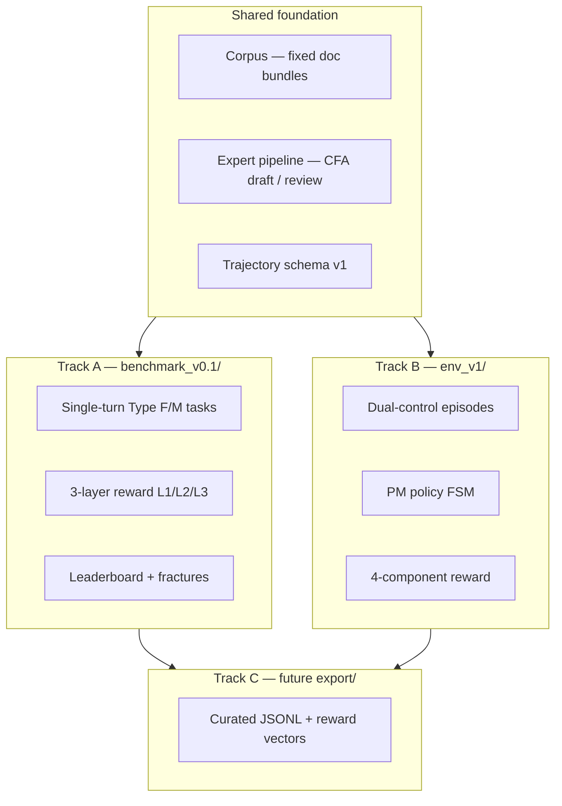

# Zstate — System Architecture

**Version:** 1.1  
**Owner:** Engineering  
**Status:** Active — Week 0 hygiene; 2 published eval tasks (GOOGL, PEP)

Canonical technical map. Product requirements live in [Framework v0.2](./ZSTATE_EQUITY_RESEARCH_BENCHMARK_FRAMEWORK.md). Priorities live in [Roadmap](./ROADMAP.md) and [Backlog](./BACKLOG.md).

---

## 1. Product tracks (one repo, three deliverables)



| Track | Path | Scoring | Primary audience |
|-------|------|---------|------------------|
| **A** | `benchmark_v0.1/` | 3-layer (weights by task type F/M) | Public credibility |
| **B** | `env_v1/` | 4-component composite | AI labs (RL signal) |
| **C** | `export/` (future) | Both | Zstate training product |

**Rule:** Do not collapse Track A and B into one task format. Same expert standards; different episode shapes.

---

## 2. Repository layout

```
Zstate/
├── docs/                          # Design + planning
│   ├── ARCHITECTURE.md              # This file
│   ├── EXPERT_REVIEW_WORKFLOW.md    # CFA ↔ Eng handoff
│   ├── ROADMAP.md / BACKLOG.md
│   ├── ZSTATE_EQUITY_RESEARCH_BENCHMARK_FRAMEWORK.md
│   ├── expert_drafts/               # Eng drafts → CFA review
│   └── specs/                       # Target platform (post-pilot)
├── schemas/                       # Cross-track JSON contracts (trajectory_v1, fracture_taxonomy_v1)
├── benchmark_v0.1/                # Track A — implemented pilot
│   ├── tasks/ ground_truth/ gold_paths/ rubrics/ scripts/
│   ├── campaigns/ contract_fixtures/
│   └── manifest.json
├── env_v1/                        # Track B — dual-control RL env
│   ├── episodes/ corpus/ pm_policies/ rubrics/
│   ├── verifier/ gold_keys.example/ examples/agents/
│   ├── scripts/ runs/
│   └── docs/                        # Env spec + methodology
└── scripts/                       # smoke_test.py, export generators
```

**Private (gitignored):** `env_v1/gold_keys/` — never commit expert answer keys or LLM-judge prompts.

---

## 3. Scoring systems (aligned, not duplicated)

### Track A — 3-layer (benchmark)

| Layer | Method | Type F weights |
|-------|--------|----------------|
| L1 Hard accuracy | Python + GT | 55% |
| L2 Judgment / section recall | Rules + gold path | 25% |
| L3 Trust / citations | Citation audit | 20% |

Implementation target: `benchmark_v0.1/scripts/verify_*.py` (L1); scoring engine spec for L2/L3.

### Track B — 4-component (env)

```
Reward = 0.45·Outcome + 0.25·Grounding + 0.20·Defense − 0.10·Hallucination
```

Implementation: `env_v1/scripts/score_episode.py` + `env_v1/verifier/weights.json`.

### Mapping

| Env component | Benchmark layer |
|---------------|-----------------|
| Outcome (binary) | L1 |
| Outcome (judgment) | L2 |
| Grounding | L2 + L3 |
| Defense | L2 (PM engagement — env only) |
| Hallucination | L3 penalty |

Single philosophy document: [Framework § Three-Layer Reward](./ZSTATE_EQUITY_RESEARCH_BENCHMARK_FRAMEWORK.md) + [env methodology](../env_v1/docs/METHODOLOGY_RL_ENV.md).

---

## 4. Data flow

### Track A (single-turn)

```
Task JSON → Agent + tool sandbox → Trajectory JSONL → L1 verify script → Reward vector → Leaderboard
```

### Track B (dual-control)

```
Episode JSON → Tool backend (fixed corpus) ↔ Agent ↔ PM FSM → Trace JSON → score_episode.py → Composite + components
```

### Shared trajectory contract

See [schemas/trajectory_v1.json](../schemas/trajectory_v1.json). Env traces are enriched via `env_v1/scripts/trace_utils.py` (`trajectory_id`, `track`, `fractures`, `reward`). Fracture codes: [schemas/fracture_taxonomy_v1.json](../schemas/fracture_taxonomy_v1.json).

---

## 5. Component specs vs implementation

| Spec (`docs/specs/`) | Pilot implementation | When to build full service |
|----------------------|----------------------|----------------------------|
| corpus-service | EDGAR JSON + `corpus/` bundles | v0.1b scale (15 cos) |
| task-registry | `benchmark_v0.1/tasks/*.json` | Expert Workbench |
| eval-orchestrator | `run_benchmark_campaign.py` + contract stubs (LATER-03) | Model adapters |
| scoring-engine | `verify_*.py` (L1 only, Track A) + `score_episode.py` | L2/L3 + automated campaigns |
| expert-workbench | Markdown drafts + sheets | P3 |

Specs describe **target architecture**; `benchmark_v0.1/` and `env_v1/` are **MVD implementations**.

---

## 6. Task taxonomy

| Type | Track | Stages | Example |
|------|-------|--------|---------|
| **F** Forensics | A | 1–2 | GOOGL footnote reconciliation |
| **M** Modeling | A | 1–3 | PEP FX organic growth |
| **C** Coverage | A (v0.5+) | 1–4 | Initiation memo + reco |
| **D** Dual-control dispute | B | tools ↔ PM | Solaris earnings quality |

Type **D** is env-only in v1; not part of 15-task MVD grid. Maps to catalog archetype `earnings_quality_dispute` (P3).

---

## 7. Anti-patterns & gold paths

Required on every published task (Track A) and episode (Track B):

- `gold_paths/*.json` or `gold_keys.example/` — minimal section set + `anti_patterns[]`
- Scoring severity: L2 penalty by default; L3 veto only when tagged ([Framework § Anti-patterns](./ZSTATE_EQUITY_RESEARCH_BENCHMARK_FRAMEWORK.md))

---

## 8. Public vs private artifacts

| Public | Private |
|--------|---------|
| Task briefs, redacted corpus excerpts | Gold keys, full PM branch conditions |
| Leaderboard, fracture taxonomy | LLM-judge prompts |
| Methodology overview | Adjudication sheets |
| Demo traces (sample) | Production verifier tuning |

---

## 9. Fracture taxonomy (shared)

Defined in Framework § Fracture Taxonomy. Env extensions:

| Code | Track B |
|------|---------|
| `PM_OOD` | PM fallback branch — agent outside script |
| `ENGAGEMENT_FAIL` | Follow-up C / Defense = 0 |
| `TIMEOUT` | No submit within turn budget |

---

## 10. Document hierarchy (avoid redundancy)

| Read first | Purpose |
|------------|---------|
| **ARCHITECTURE.md** | How the repo is structured |
| **ROADMAP.md / BACKLOG.md** | What to build when |
| **Framework v0.2** | Why and product scope |
| **Task catalog / definitions** | Full ER workflow index (185) |
| **env_v1/docs/dual_control_spec_v1.md** | Track B episode design |
| **specs/** | Future services — not current sprint |

Do not duplicate scoring weights or track definitions across files — link here or to Framework.
