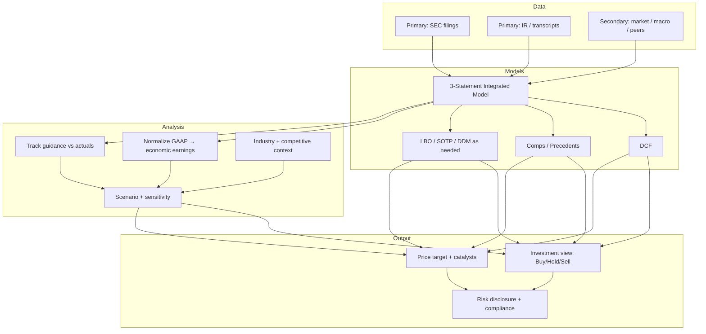
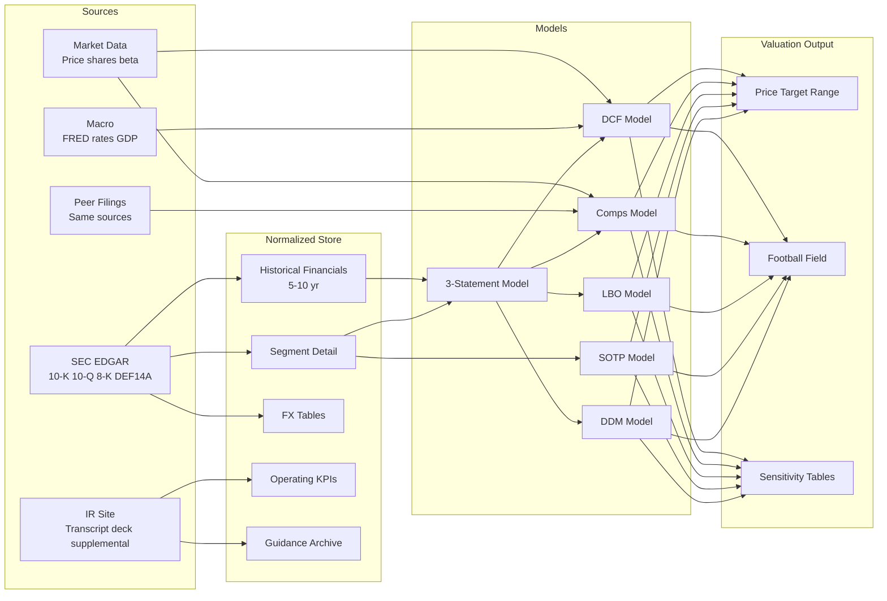
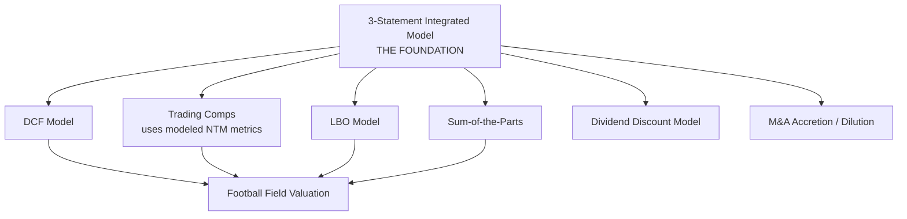
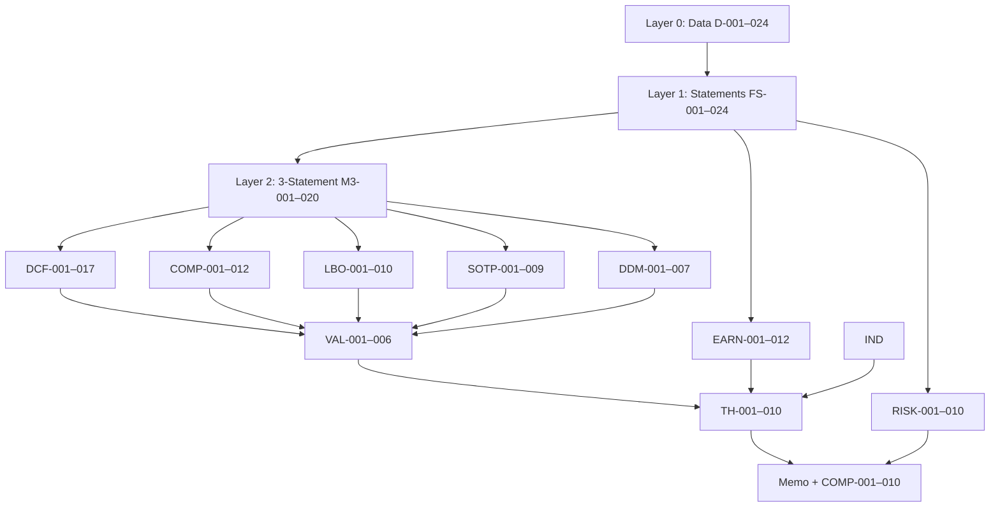

# Equity Research Agent Benchmark — Exhaustive Task Catalog
## Senior Analyst Workflow Decomposition

**Version:** 0.1  
**Audience:** Zstate product, domain experts, platform engineering  
**Purpose:** Exhaustive map of what a credentialed equity research agent must be able to do — from raw SEC/IR data through models, analysis, thesis, and compliant output.  
**Companion doc:** [Framework Proposal](./ZSTATE_EQUITY_RESEARCH_BENCHMARK_FRAMEWORK.md)

---

## Table of Contents

1. [Senior Analyst Mental Model](#1-senior-analyst-mental-model)
2. [End-to-End Workflow (Master)](#2-end-to-end-workflow-master)
3. [Layer 0 — Data Acquisition & Normalization](#3-layer-0--data-acquisition--normalization)
4. [Layer 1 — Financial Statement Intelligence](#4-layer-1--financial-statement-intelligence)
5. [Layer 2 — Financial Model Construction](#5-layer-2--financial-model-construction)
6. [Layer 3 — Valuation Methodologies](#6-layer-3--valuation-methodologies)
7. [Layer 4 — Industry & Competitive Analysis](#7-layer-4--industry--competitive-analysis)
8. [Layer 5 — Earnings, Guidance & Estimate Workflow](#8-layer-5--earnings-guidance--estimate-workflow)
9. [Layer 6 — Investment Thesis & Judgment](#9-layer-6--investment-thesis--judgment)
10. [Layer 7 — Risk, ESG & Special Situations](#10-layer-7--risk-esg--special-situations)
11. [Layer 8 — Output Artifacts & Compliance](#11-layer-8--output-artifacts--compliance)
12. [Full Task Catalog (Indexed)](#12-full-task-catalog-indexed)
13. [Sector-Specific Task Variants](#13-sector-specific-task-variants)
14. [Task Dependencies & Sequencing](#14-task-dependencies--sequencing)
15. [Benchmark Packaging — How Tasks Group into Eval Units](#15-benchmark-packaging--how-tasks-group-into-eval-units)
16. [Mapping to MVD (45 Tasks) vs Full Catalog (200+ Micro-Tasks)](#16-mapping-to-mvd-45-tasks-vs-full-catalog-200-micro-tasks)
17. [Agent Capability Matrix](#17-agent-capability-matrix)

---

## 1. Senior Analyst Mental Model

A senior equity research analyst does not “answer questions about a 10-K.” They execute a **repeatable research operating system**:



**Key insight for benchmark design:** Each box is not one task — it is a **cluster of 10–30 micro-tasks**, many of which are only meaningful if prior steps were done correctly (e.g., DCF is worthless if CapEx was pulled from the wrong period or FCF sign is wrong).

**Design principle:** Benchmark tasks must test **dependency chains**, not isolated fact retrieval.

---

## 2. End-to-End Workflow (Master)

### 2.1 The 12-Phase Research Lifecycle

| Phase | Name | Analyst question | Typical duration (human) |
|-------|------|------------------|--------------------------|
| **P0** | Coverage initiation | Should we cover this name? What peers? | 1–2 days |
| **P1** | Data assembly | Do we have clean historicals + latest quarter? | 0.5–1 day |
| **P2** | Statement normalization | What is *economic* earnings vs GAAP headline? | 1–2 days |
| **P3** | Integrated model build | How do drivers flow through 3 statements? | 3–5 days |
| **P4** | Valuation stack | What is it worth on DCF, comps, SOTP, LBO? | 2–3 days |
| **P5** | Industry context | Where does this name sit vs industry structure? | 1–2 days |
| **P6** | Guidance & earnings | What did mgmt promise vs deliver? | Ongoing / 0.5 day per quarter |
| **P7** | Thesis formation | Bull vs bear — what is the variant perception? | 1–2 days |
| **P8** | Scenario & sensitivity | What breaks the thesis? | 0.5–1 day |
| **P9** | Risk & footnote deep dive | What is off-balance-sheet or non-obvious? | 1–2 days |
| **P10** | Memo & recommendation | Buy/Hold/Sell with target and catalysts | 1–2 days |
| **P11** | Compliance & refresh | Mandate check; update post-earnings | 0.5 day |

**Agent benchmark implication:** Long-horizon eval units should span **P1 → P10** minimum. Short micro-benchmarks test individual skills within a phase but must declare prerequisites (e.g., “given normalized historicals, build DCF”).

### 2.2 Master Data Flow



---

## 3. Layer 0 — Data Acquisition & Normalization

**Prerequisite for everything.** If data is wrong, every downstream model is wrong.

### 3.1 SEC EDGAR — Document Types & Use Cases

| Document | What analyst uses it for | Agent benchmark tasks |
|----------|-------------------------|------------------------|
| **10-K** | Audited annual financials, full footnotes, risk factors, segments | Historical extraction, footnote reconciliation, segment mapping |
| **10-Q** | Unaudited quarterly update, MD&A changes, interim KPIs | QoQ/YoY trends, guidance drift vs actuals |
| **8-K** | Material events: M&A, CEO change, pre-release, impairment | Event-driven task: “Identify trigger and restatement impact” |
| **DEF 14A (Proxy)** | Exec comp, board, related-party transactions | Comp benchmarking, governance flags |
| **S-1 / F-1** | IPO or spin-off detail | Pre-IPO normalization (optional advanced) |
| **13D/13G** | Activist ownership | Special situation context |
| **EX-99.1 (Exhibits)** | Earnings release attached to 8-K | Cross-check press release vs 10-Q |

### 3.2 IR Materials — Document Types

| Material | Source | Use case |
|----------|--------|----------|
| Earnings call transcript | IR / transcript API | Guidance extraction, tone, Q&A nuance |
| Shareholder letter / annual report | IR | Strategic priorities, non-GAAP definitions |
| Investor presentation | IR PDF | KPI definitions, TAM slides, bridge charts |
| Supplemental financial data | IR Excel/PDF | Segment detail not in 10-K |
| Investor day deck | IR | Long-term targets, capital allocation framework |
| ESG / sustainability report | IR | Mandate-relevant (Phase 2) |

### 3.3 Market & Macro Data

| Data | Source (MVD) | Feeds into |
|------|--------------|------------|
| Share price, shares outstanding | Market data API (Phase 1.5) | Market cap, DCF equity value |
| Beta, risk-free rate, ERP | FRED + regression | WACC |
| Peer prices / multiples | Market data + peer filings | Comps |
| FX rates (avg, period-end) | FRED / 10-K FX note | Cross-border models |
| Industry growth rates | Filings + macro | Terminal growth bounds |
| Commodity indices | FRED | PEP, MDLZ input cost sensitivity |

### 3.4 Layer 0 — Exhaustive Micro-Task List

| Task ID | Task | Input | Output | Pass criteria |
|---------|------|-------|--------|---------------|
| **D-001** | Map ticker → CIK | Ticker | CIK, entity name | Matches SEC |
| **D-002** | Fetch latest 10-K for fiscal year | Ticker, FY | Raw filing + metadata | Correct FY, correct amendment handling |
| **D-003** | Fetch all 10-Qs for trailing 8 quarters | Ticker | 8 filings indexed | No gap quarters |
| **D-004** | Detect filing amendments (10-K/A) | CIK | Amended vs superseded flag | Uses latest amendment |
| **D-005** | Parse fiscal calendar (Dec vs Jun vs Sep FY) | 10-K | FY end month | Correct period mapping |
| **D-006** | Extract income statement (3–5 yr) | 10-K series | IS table JSON | Units, signs, periods correct |
| **D-007** | Extract balance sheet (2–5 yr) | 10-K/10-Q | BS table JSON | Current vs non-current split |
| **D-008** | Extract cash flow statement (3–5 yr) | 10-K series | CF table JSON | OCF/ICF/FCF lines identified |
| **D-009** | Identify unit convention (thousands vs millions) | Any filing table | Unit multiplier | No 1000× errors |
| **D-010** | Distinguish GAAP vs non-GAAP labels in IR deck | IR PDF | Label map | Does not conflate |
| **D-011** | Pull earnings transcript for specific quarter | Ticker, Q | Transcript text + metadata | Correct call date |
| **D-012** | Align transcript quarter to 10-Q fiscal period | Transcript + 10-Q | Period link | Off-by-one quarter fail |
| **D-013** | Fetch investor presentation for same quarter | IR | Deck PDF | Matches earnings date |
| **D-014** | Extract supplemental KPI table from IR | Deck/Excel | KPI time series | Matches 10-Q if cross-check exists |
| **D-015** | Build peer universe (5–8 names) by GICS/segment | Target ticker | Peer list + rationale | Sector-appropriate peers |
| **D-016** | Pull 10-K for all peers | Peer list | Peer historicals | Same fiscal calendar note |
| **D-017** | Load FX avg rates for reported currencies | 10-K FX note + FRED | Rate table | Weighted avg vs spot flagged |
| **D-018** | Load shares outstanding (basic + diluted) | 10-K/10-Q | Share count by period | Uses weighted avg for EPS, period-end for cap |
| **D-019** | Load net debt components | BS + debt footnote | Net debt calc | Includes ST debt, leases per policy |
| **D-020** | Flag restatement / accounting change in footnotes | 10-K notes | Change log | Surfaces prior period adjustments |
| **D-021** | Ingest 8-K for material event in window | Ticker, date range | Event summary | Correct materiality |
| **D-022** | Cross-check 8-K EX-99.1 press release to 10-Q | 8-K + 10-Q | Discrepancy report | Catches pre-release vs filed diff |
| **D-023** | Version corpus snapshot | All docs | Manifest checksum | Reproducible |
| **D-024** | Cite every extracted number | Any extraction | `{doc_id, page, snippet}` | 100% citation coverage |

---

## 4. Layer 1 — Financial Statement Intelligence

Before modeling: **understand what the numbers mean**.

### 4.1 Normalization Categories (Senior Analyst Standard)

| Category | Examples | Why it matters |
|----------|----------|----------------|
| **Non-recurring items** | Restructuring, asset sale gain, litigation | Core earnings vs headline |
| **Stock-based compensation** | Tech names | Cash vs non-cash debate; segment allocation |
| **Acquisition-related** | Amort of intangibles, transaction costs | M&A-heavy names (DIS, MDLZ history) |
| **Lease accounting (ASC 842)** | MCD, SBUX | EBITDAR vs EBITDAR-less-rent |
| **Tax anomalies** | One-time tax benefit (GOOGL, AAPL) | Effective rate normalization |
| **FX translation vs transaction** | AMZN, PEP international | Organic vs reported growth |
| **Content / R&D capitalization** | NFLX content assets, GOOGL cloud cap software | Cash flow vs P&L timing |
| **Franchise vs company-operated** | MCD, SBUX | Unit economics differ |

### 4.2 Layer 1 — Exhaustive Micro-Task List

| Task ID | Task | Skill tested |
|---------|------|--------------|
| **FS-001** | Identify all non-GAAP reconciliations in earnings release | Non-GAAP discipline |
| **FS-002** | Rebuild GAAP → adjusted EBITDA bridge | Normalization |
| **FS-003** | Separate recurring vs one-time in operating income | Core earnings |
| **FS-004** | Footnote reconciliation: segment revenue ↔ consolidated | **MVD archetype** |
| **FS-005** | Footnote reconciliation: inventory costing change impact | Accounting change |
| **FS-006** | Extract stock-based comp from footnote + cash flow | Tech normalization |
| **FS-007** | Allocate SBC to segments when not directly reported | Judgment + footnote |
| **FS-008** | Identify capitalized software / R&D from footnotes | GOOGL, MSFT |
| **FS-009** | Compute content amortization vs cash content spend (NFLX) | Media economics |
| **FS-010** | Reconcile franchise revenue vs company-operated (MCD) | Business model |
| **FS-011** | Identify lease-adjusted metrics when relevant | Retail / restaurants |
| **FS-012** | Calculate organic constant-currency revenue growth | **MVD archetype** |
| **FS-013** | Decompose price vs volume vs mix (when disclosed) | Consumer (PEP) |
| **FS-014** | Track goodwill impairment triggers in footnotes | Media, legacy M&A |
| **FS-015** | Read debt maturity schedule from footnote | Credit overlay |
| **FS-016** | Quantify off-balance-sheet commitments | Risk |
| **FS-017** | Identify related-party transactions (proxy + footnotes) | Governance |
| **FS-018** | Verify cash flow sign conventions (CapEx, buybacks, dividends) | Critical for FCF |
| **FS-019** | Reconcile net income → OCF → FCF | Statement integration |
| **FS-020** | Flag auditor opinion changes or going concern | Risk |
| **FS-021** | Compare MD&A narrative to quantitative trend | Narrative vs numbers |
| **FS-022** | Identify change in accounting principle (Note 1) | Restatement risk |
| **FS-023** | Extract segment OP vs consolidated OP reconciliation | Conglomerates |
| **FS-024** | Calculate NOPAT for ROIC | Valuation input |

---

## 5. Layer 2 — Financial Model Construction

**This is the core.** Senior analysts spend most time here. Models are not optional — they are how you **prove** you understand the business.

### 5.1 Model Hierarchy



**Rule:** Benchmark must include tasks that test whether the agent **built the foundation before stacking valuation**.

### 5.2 Model 1 — Three-Statement Integrated Model

**Purpose:** Project income statement, balance sheet, and cash flow statement linked by accounting identities.

| Component | Rows / schedules | Data source |
|-----------|------------------|-------------|
| **Income statement** | Revenue → gross profit → EBIT → net income | 10-K/10-Q + drivers |
| **Revenue build** | By segment, geography, or unit × price | Segment footnotes, IR KPIs |
| **Cost structure** | COGS, OpEx (R&D, S&M, G&A) | Historical margins + guidance |
| **D&A schedule** | PP&E roll-forward | CapEx footnote, depreciation policy |
| **CapEx schedule** | Maintenance vs growth | MD&A, guidance, industry norms |
| **Working capital** | DSO, DIO, DPO | BS historical, peer benchmarks |
| **Debt schedule** | Interest expense, repayments, covenants | Debt footnote |
| **Equity schedule** | SBC, buybacks, dividends | CF + equity footnote |
| **Cash roll-forward** | Ending cash ties to BS | Must balance |
| **Balance sheet** | Assets = Liabilities + Equity | Every period |

**Accounting identity checks (mandatory in agent eval):**

```
✓ Assets = Liabilities + Shareholders' Equity (every period)
✓ Ending cash (CF) = Cash on BS
✓ Retained earnings roll-forward ties
✓ Debt schedule ties to BS debt lines
```

#### 3-Statement Micro-Tasks

| Task ID | Task | Output |
|---------|------|--------|
| **M3-001** | Build 5-year historical IS from filings | Historical IS |
| **M3-002** | Build 5-year historical BS + CF | Historical BS/CF |
| **M3-003** | Identify revenue drivers by segment | Driver map |
| **M3-004** | Forecast revenue 5 yr forward (segment-level) | Projected IS revenue |
| **M3-005** | Forecast gross margin with commodity sensitivity (PEP) | Margin schedule |
| **M3-006** | Forecast OpEx as % rev or absolute with leverage | OpEx schedule |
| **M3-007** | Build D&A from PP&E roll-forward | D&A schedule |
| **M3-008** | Build CapEx schedule (maint + growth) | CapEx schedule |
| **M3-009** | Build NWC schedule (DSO/DIO/DPO) | WC schedule |
| **M3-010** | Link PP&E: beginning + CapEx − D&A = ending | PP&E roll |
| **M3-011** | Build debt schedule with interest at effective rate | Debt schedule |
| **M3-012** | Model SBC and share count dilution | Equity schedule |
| **M3-013** | Model buyback program from CF + authorization | Share repurchase |
| **M3-014** | Model dividend payout (PEP, KO, MCD) | Dividend schedule |
| **M3-015** | Complete cash flow statement (indirect method) | Projected CF |
| **M3-016** | Verify A = L + E for all projected years | Balance check |
| **M3-017** | Calculate UFCF from projected statements | FCF for DCF |
| **M3-018** | Scenario: recession case revenue −10% | Downside IS/CF |
| **M3-019** | Scenario: margin expansion case | Upside IS/CF |
| **M3-020** | Export model assumptions with citations | Assumption log |

### 5.3 Model 2 — DCF (Discounted Cash Flow)

**Purpose:** Intrinsic value from unlevered free cash flows.

| Component | Detail |
|-----------|--------|
| **UFCF** | EBIT(1−t) + D&A − CapEx − ΔNWC (from 3-statement) |
| **WACC** | Cost of equity (CAPM) + cost of debt, weighted |
| **Terminal value** | Gordon growth OR exit EV/EBITDA multiple |
| **Enterprise → equity** | EV − net debt + non-operating assets |
| **Per share** | Equity value ÷ diluted shares |
| **Sensitivity** | WACC × terminal g grid |

#### DCF Micro-Tasks

| Task ID | Task | Output |
|---------|------|--------|
| **DCF-001** | Calculate CAPM cost of equity (Rf, β, ERP) | Ke |
| **DCF-002** | Justify beta source (2-yr vs 5-yr regression) | Beta memo |
| **DCF-003** | Calculate pre-tax cost of debt from filings | Kd |
| **DCF-004** | Compute market-value weights for WACC | WACC |
| **DCF-005** | Project UFCF 5–10 years from 3-statement | UFCF series |
| **DCF-006** | Choose terminal method (Gordon vs exit multiple) with rationale | Method note |
| **DCF-007** | Bound terminal growth vs long-term GDP + industry | Terminal g |
| **DCF-008** | Compute Gordon terminal value | TV |
| **DCF-009** | Compute exit multiple terminal value | TV alt |
| **DCF-010** | Discount UFCF + TV to present | PV of CF |
| **DCF-011** | Bridge EV to equity value | Equity value |
| **DCF-012** | Compute implied share price | Price target |
| **DCF-013** | Build WACC × terminal g sensitivity table | 5×5 grid |
| **DCF-014** | Build exit multiple sensitivity | Multiple grid |
| **DCF-015** | Compare DCF implied price to current market price | Upside/downside % |
| **DCF-016** | Document every assumption with source | Assumption audit |
| **DCF-017** | Flag if DCF relies on unverified inputs | Uncertainty |

### 5.4 Model 3 — Trading Comps (Comparable Companies)

**Purpose:** Relative valuation vs peer set.

| Component | Detail |
|-----------|--------|
| **Peer selection** | Same sector, size, growth, geography |
| **Multiples** | EV/EBITDA, EV/Revenue, P/E, P/FCF, sector-specific (P/sub for NFLX historical) |
| **LTM vs NTM** | Trailing from filings; NTM from model |
| **Adjustments** | Stock comp, one-times for EBITDA |
| **Statistics** | Mean, median, 25th/75th |
| **Implied value** | Apply peer median multiple to target metrics |

#### Comps Micro-Tasks

| Task ID | Task | Output |
|---------|------|--------|
| **COMP-001** | Select 5–8 peers with written rationale | Peer list |
| **COMP-002** | Pull LTM revenue, EBITDA, EPS for peers | Peer metrics |
| **COMP-003** | Normalize peer EBITDA (add back one-times) | Adj EBITDA |
| **COMP-004** | Calculate EV for peers (market cap + net debt) | Enterprise values |
| **COMP-005** | Compute EV/EBITDA, EV/Revenue, P/E for peers | Multiple table |
| **COMP-006** | Compute median and mean multiples | Summary stats |
| **COMP-007** | Apply median EV/EBITDA to target NTM EBITDA | Implied EV |
| **COMP-008** | Apply median P/E to target NTM EPS | Implied price |
| **COMP-009** | Explain premium/discount vs peers | Relative view |
| **COMP-010** | Sector-specific comp (e.g., EV/subscriber NFLX) | Custom multiple |
| **COMP-011** | Flag inappropriate comp (wrong sector) | Judgment |
| **COMP-012** | Update comps post-earnings | Refresh task |

### 5.5 Model 4 — LBO (Leveraged Buyout)

**Purpose:** Floor valuation / PE takeout feasibility (relevant for mature cash generators: PEP, MCD, CMCSA).

| Component | Detail |
|-----------|--------|
| **Entry EV** | Based on comps or public market |
| **Debt tranches** | Senior, sub, rates, amortization |
| **Sources & uses** | Debt + equity = purchase price + fees |
| **Operational improvement** | Margin expansion, CapEx efficiency |
| **Exit** | Year 5 exit multiple |
| **Returns** | IRR, MOIC to equity |
| **Covenants** | Max leverage (high-level) |

#### LBO Micro-Tasks

| Task ID | Task | Output |
|---------|------|--------|
| **LBO-001** | Set entry EV/multiple with rationale | Entry valuation |
| **LBO-002** | Build sources & uses table | S&U |
| **LBO-003** | Layer debt tranches (60–70% leverage typical) | Debt structure |
| **LBO-004** | Project 5-yr FCF under PE ownership | FCF forecast |
| **LBO-005** | Model debt paydown from excess FCF | Debt schedule |
| **LBO-006** | Set exit EV/EBITDA at year 5 | Exit value |
| **LBO-007** | Calculate equity IRR and MOIC | Returns |
| **LBO-008** | Sensitivity: entry vs exit multiple | IRR grid |
| **LBO-009** | Assess if public co is LBO-able (FCF, stability) | Feasibility memo |
| **LBO-010** | Compare LBO implied price to DCF | Valuation triangulation |

### 5.6 Model 5 — Sum-of-the-Parts (SOTP)

**Purpose:** Conglomerates with distinct businesses (GOOGL, AMZN, DIS, CMCSA).

| Component | Detail |
|-----------|--------|
| **Segment identification** | From 10-K segments |
| **Segment valuation** | Separate comps or DCF per segment |
| **Holdco discount** | Typical 10–20% unless synergy case |
| **Corporate costs** | Unallocated overhead |
| **Equity value** | Sum − net debt |

#### SOTP Micro-Tasks

| Task ID | Task | Output |
|---------|------|--------|
| **SOTP-001** | Map reportable segments to valuation buckets | Segment map |
| **SOTP-002** | Assign peer comp set per segment | Segment peers |
| **SOTP-003** | Value segment A on EV/EBITDA (e.g., AWS) | Segment EV |
| **SOTP-004** | Value segment B on different multiple (e.g., ads) | Segment EV |
| **SOTP-005** | Apply holdco discount with rationale | Discount % |
| **SOTP-006** | Allocate corporate overhead | Corp adjustment |
| **SOTP-007** | Sum to total EV → equity → per share | SOTP price |
| **SOTP-008** | Compare SOTP to consolidated DCF | Triangulation |
| **SOTP-009** | Identify hidden value (Waymo, etc.) — flag if unlisted | Disclosure gap |

### 5.7 Model 6 — Dividend Discount Model (DDM)

**Purpose:** Income names (PEP, KO, MCD) under Conservative Income mandate.

| Task ID | Task | Output |
|---------|------|--------|
| **DDM-001** | Extract dividend history 10 yr | DPS series |
| **DDM-002** | Compute payout ratio vs FCF and EPS | Coverage |
| **DDM-003** | Project dividend growth 5 yr | DPS forecast |
| **DDM-004** | Calculate cost of equity (CAPM) | Ke |
| **DDM-005** | Gordon growth DDM or multi-stage DDM | Intrinsic value |
| **DDM-006** | Assess dividend sustainability in downturn | Stress test |
| **DDM-007** | Compare yield to peer income names | Relative yield |

### 5.8 Model 7 — M&A Accretion / Dilution (Optional Advanced)

| Task ID | Task | Output |
|---------|------|--------|
| **MA-001** | Model acquirer + target combined IS | Pro forma |
| **MA-002** | Synergy assumptions with timing | Synergy schedule |
| **MA-003** | Compute EPS accretion/dilution | Accretion % |
| **MA-004** | Sources & uses for deal financing | Deal structure |

---

## 6. Layer 3 — Valuation Methodologies

### 6.1 Valuation Stack (How Senior Analysts Triangulate)

| Method | When primary | When secondary |
|--------|-------------|----------------|
| **DCF** | Stable FCF, long runway | Always as sanity check |
| **Comps** | Most coverage situations | Relative anchor |
| **SOTP** | Conglomerates | Hidden value |
| **LBO** | Mature, high FCF | Floor value |
| **DDM** | Dividend aristocrats | Income mandates |
| **Precedent transactions** | M&A-heavy sectors | Media consolidation |

### 6.2 Football Field & Price Target

| Task ID | Task | Output |
|---------|------|--------|
| **VAL-001** | Combine DCF, comps, SOTP, LBO ranges | Football field chart |
| **VAL-002** | Assign weight to each methodology | Weighted target |
| **VAL-003** | Set 12-month price target with range | PT + bull/bear |
| **VAL-004** | Compute upside/downside to current | % return |
| **VAL-005** | Reconcile wide dispersion (>30% spread) | Explain variance |
| **VAL-006** | Update target post-model refresh | Revision task |

---

## 7. Layer 4 — Industry & Competitive Analysis

| Task ID | Task | Output |
|---------|------|--------|
| **IND-001** | Porter's Five Forces for sector | Forces memo |
| **IND-002** | TAM/SAM/SOM from IR + third-party bounds | Market size |
| **IND-003** | Market share trends for target vs peers | Share table |
| **IND-004** | Pricing power evidence (margin vs input costs) | Pricing analysis |
| **IND-005** | Regulatory overlay (banking, media, tech antitrust) | Regulatory section |
| **IND-006** | Disruption risk (streaming vs linear, AI vs search) | Threat matrix |
| **IND-007** | Supply chain / input cost sensitivity | Commodity linkage |
| **IND-008** | Capital intensity comparison vs peers | ROIC comparison |
| **IND-009** | Industry cycle positioning | Cycle note |

---

## 8. Layer 5 — Earnings, Guidance & Estimate Workflow

**This is the ongoing heartbeat of equity research.**

### 8.1 Earnings Cycle Tasks

| Task ID | Task | Timing |
|---------|------|--------|
| **EARN-001** | Pre-earnings preview note | T−5 to T−1 days |
| **EARN-002** | Extract consensus expectations (if available) | Pre-earnings |
| **EARN-003** | Identify key KPIs to watch (subs, ASP, traffic) | Pre-earnings |
| **EARN-004** | Real-time earnings recap | T+0 |
| **EARN-005** | Compare actual vs preview assumptions | T+0 |
| **EARN-006** | Extract guidance raise/lower/maintenance | T+0 |
| **EARN-007** | **Guidance drift: Q2 call vs Q3/Q4 10-Q** | **MVD archetype** |
| **EARN-008** | Update model for new quarter actuals | T+1 |
| **EARN-009** | Revise price target post-earnings | T+1 to T+3 |
| **EARN-010** | Identify estimate revision catalyst | Ongoing |
| **EARN-011** | Track management tone change NLP | Qualitative |
| **EARN-012** | Compare press release non-GAAP to 10-Q GAAP | Normalization |

---

## 9. Layer 6 — Investment Thesis & Judgment

| Task ID | Task | Skill |
|---------|------|-------|
| **TH-001** | State variant perception vs consensus | Core ER skill |
| **TH-002** | Bull case (3 pillars) | Structured thesis |
| **TH-003** | Bear case (3 pillars) | Risk thinking |
| **TH-004** | Base case with assigned probability | Scenario weights |
| **TH-005** | Identify 3 near-term catalysts | Catalyst calendar |
| **TH-006** | Moat assessment (network, scale, brand, switching) | Qualitative |
| **TH-007** | Management quality assessment | Proxy + track record |
| **TH-008** | Capital allocation scorecard (buyback, M&A, dividend) | Judgment |
| **TH-009** | Recommend Buy/Hold/Sell with conviction | Final view |
| **TH-010** | Explain recommendation in 2 sentences for PM | Communication |

---

## 10. Layer 7 — Risk, ESG & Special Situations

| Task ID | Task | Output |
|---------|------|--------|
| **RISK-001** | Top 5 company-specific risks | Risk section |
| **RISK-002** | Liquidity / solvency analysis | Current ratio, debt/EBITDA |
| **RISK-003** | Customer concentration (10-K) | Concentration % |
| **RISK-004** | Legal contingencies quantification | Contingent liability |
| **RISK-005** | China / geopolitical exposure | Geographic risk |
| **RISK-006** | Refinancing wall from debt schedule | Maturity chart |
| **RISK-007** | Downside case price (−30% scenario) | Bear price |
| **RISK-008** | ESG mandate flag (exclusions) | Mandate check |
| **RISK-009** | Activist situation (13D) | Special sit memo |
| **RISK-010** | Spin-off / restructuring tracking | Event task |

---

## 11. Layer 8 — Output Artifacts & Compliance

### 11.1 Deliverable Types

| Artifact | Sections | Agent must produce |
|----------|----------|-------------------|
| **Initiation report** | Full coverage: business, industry, model, val, risks, reco | Long-horizon eval |
| **Quarterly update** | Earnings recap + model update + PT change | Medium horizon |
| **Flash note** | Event-driven 1-pager | Short horizon |
| **Model audit memo** | Assumptions + citations only | Micro eval |
| **Investment committee deck** | 5–10 slides summary | Structured output |

### 11.2 Compliance Micro-Tasks

| Task ID | Task | Pass |
|---------|------|------|
| **COMP-001** | Separate fact from opinion | Required |
| **COMP-002** | No guaranteed return language | FINRA |
| **COMP-003** | Risk of loss disclosure | FINRA |
| **COMP-004** | Price target disclaimer | FINRA |
| **COMP-005** | Long-only mandate compliance | No short language |
| **COMP-006** | Conservative income: dividend risk disclosed | Mandate |
| **COMP-007** | No speculative language without bounds | Mandate |
| **COMP-008** | Cite all material data points | Audit |
| **COMP-009** | Flag unverified data explicitly | Trust |
| **COMP-010** | Past performance disclaimer if cited | FINRA |

---

## 12. Full Task Catalog (Indexed)

### Summary by layer

| Layer | Code prefix | Task count | Description |
|-------|-------------|------------|-------------|
| 0 — Data | D- | 24 | SEC, IR, market, macro, peers |
| 1 — Financial statements | FS- | 24 | Normalization, reconciliation, footnotes |
| 2 — Models | M3-, DCF-, COMP-, LBO-, SOTP-, DDM-, MA- | 20+17+12+10+9+7+4 = **79** | All financial models |
| 3 — Valuation stack | VAL- | 6 | Football field, price target |
| 4 — Industry | IND- | 9 | Sector analysis |
| 5 — Earnings | EARN- | 12 | Preview, recap, guidance drift |
| 6 — Thesis | TH- | 10 | Bull/bear, catalysts, reco |
| 7 — Risk | RISK- | 10 | Downside, contingencies |
| 8 — Compliance | COMP- | 10 | FINRA + mandates |
| **Total indexed micro-tasks** | | **~184** | Expandable to 200+ with sector variants |

---

## 13. Sector-Specific Task Variants

### Technology (GOOGL, AMZN, META, MSFT, AAPL)

| Priority tasks | Why |
|----------------|-----|
| M3-008 CapEx + cloud infra | AI capex cycle |
| FS-006 SBC normalization | Major EPS impact |
| SOTP-001–009 | Segment valuation (Cloud, AWS, Ads) |
| DCF with terminal g bounded for high-growth | Speculative language mandate |
| IND-006 disruption (AI search, cloud share) | Thesis |
| FS-008 capitalized software | GOOGL/MSFT specific |

### Media (NFLX, DIS, WBD, CMCSA, SPOT)

| Priority tasks | Why |
|----------------|-----|
| FS-009 content amortization vs cash | NFLX/DIS economics |
| EARN-007 guidance drift on subs/DTC | Core KPI |
| COMP-010 EV/subscriber or EV/sub | Sector multiples |
| FS-014 goodwill impairment | WBD, legacy M&A |
| SOTP for DIS (Experiences vs Entertainment) | Conglomerate |
| LBO for CMCSA (cash generative) | Floor valuation |

### Consumer (PEP, MCD, KO, SBUX, MDLZ)

| Priority tasks | Why |
|----------------|-----|
| FS-012 organic CC growth | **MVD FX archetype** |
| FS-013 price/volume/mix | PEP, KO |
| FS-010 franchise vs company-op | MCD, SBUX |
| DDM-001–007 | Conservative income mandate |
| IND-007 commodity input costs | Margin sensitivity |
| LBO-009 feasibility | MCD, PEP as LBO candidates |

---

## 14. Task Dependencies & Sequencing



### Hard dependencies (agent cannot skip)

| Task | Requires |
|------|----------|
| DCF-005 (project UFCF) | M3-015, M3-017 completed |
| DCF-004 (WACC) | D-018, D-019, market data |
| COMP-007 (implied EV) | M3-004 (NTM EBITDA), COMP-006 |
| LBO-004 (FCF under PE) | M3-015 |
| SOTP-007 (sum to price) | SOTP-003–006, D-019 net debt |
| EARN-007 (guidance drift) | D-011, D-002, D-003 |
| VAL-001 (football field) | ≥2 valuation methods complete |
| TH-009 (Buy/Hold/Sell) | VAL-003, RISK-001, COMP-001–010 |

---

## 15. Benchmark Packaging — How Tasks Group into Eval Units

Micro-tasks are grouped into **eval units** of three types:

### Type A — Micro benchmark (single skill)

- **Example:** FS-004 Footnote reconciliation only  
- **Duration:** 1 agent session  
- **Use:** Diagnostic, skill isolation  

### Type B — Model benchmark (dependency chain)

- **Example:** D-006→M3-001→M3-004→M3-016→DCF-001→DCF-012  
- **Duration:** Long-horizon (multi-stage workflow)  
- **Use:** Test integrated modeling ability  

### Type C — Full coverage benchmark (initiation report)

- **Example:** P1→P10 complete initiation on one name  
- **Duration:** Very long-horizon  
- **Use:** End-to-end agent eval (premium tier)  

### Recommended MVD packaging (45 tasks)

| MVD task type | Count | Maps to catalog |
|---------------|-------|-----------------|
| Footnote reconciliation | 15 | FS-004 + D-024 + COMP-008 |
| Guidance drift | 15 | EARN-007 + D-011 + FS-021 |
| Cross-border FX model | 15 | FS-012 + D-017 + M3-004 + DCF optional |
| **Phase 1.5 additions** | +15 | 3-statement mini-model per sector (5 each) |
| **Phase 2 additions** | +15 | DCF + comps bundle per sector (5 each) |

---

## 16. Mapping to MVD (45 Tasks) vs Full Catalog (200+ Micro-Tasks)

| Dimension | MVD v0.1 (now) | Full catalog (target) |
|-----------|----------------|----------------------|
| Tasks | 45 eval units | 184+ micro-tasks |
| Models tested | Implicit in FX/footnote | Explicit 3-stmt, DCF, comps, LBO, SOTP, DDM |
| Data layer | SEC + transcripts | + market data, IR decks, 8-K |
| Horizons | Medium (1 session) | Micro to full initiation |
| Sectors | 15 names, 3 sectors | Same + expand |
| Expert load | 20–30 hr/wk | Scales with catalog |

**Roadmap:**

```
v0.1  → 45 tasks (3 archetypes)           — prove framework
v0.2  → +45 tasks (3-statement model)     — model construction
v0.3  → +45 tasks (DCF + comps)           — valuation stack
v0.4  → +30 tasks (LBO, SOTP, DDM)        — advanced valuation
v0.5  → +20 tasks (full initiation)       — end-to-end coverage
        ─────────────────────────────────
        ~185 tasks ≈ full catalog coverage
```

---

## 17. Agent Capability Matrix

What each model tier should achieve as benchmark matures:

| Capability | Tier C (base) | Tier B (mid) | Tier A (frontier) |
|------------|---------------|--------------|-------------------|
| Extract IS line from 10-K | ✓ | ✓ | ✓ |
| Footnote reconciliation | ◐ | ✓ | ✓ |
| Guidance drift analysis | ◐ | ✓ | ✓ |
| Build linked 3-statement | ✗ | ◐ | ✓ |
| DCF with bounded terminal g | ✗ | ◐ | ✓ |
| Comps with normalized EBITDA | ✗ | ✓ | ✓ |
| LBO returns calculation | ✗ | ◐ | ✓ |
| SOTP for conglomerate | ✗ | ◐ | ✓ |
| Full initiation memo + compliance | ✗ | ◐ | ✓ |
| Uncertainty calibration | ◐ | ✓ | ✓ |

✓ = expected pass | ◐ = partial | ✗ = expected fail

---

## Appendix A — Example: Full Task Chain for PepsiCo Initiation

*Illustrates how micro-tasks compose into a real analyst workflow.*

| Step | Task IDs | Output |
|------|----------|--------|
| 1 | D-001–005, D-002–003 | PEP filings ingested |
| 2 | D-006–009, FS-001–003 | Historical statements normalized |
| 3 | FS-012–013, D-017 | Organic growth + price/volume |
| 4 | M3-001–020 | 5-yr integrated model |
| 5 | DCF-001–017 | DCF price target |
| 6 | COMP-001–012 | Peer comps (KO, MDLZ) |
| 7 | DDM-001–007 | Dividend view (mandate) |
| 8 | IND-007 | Commodity sensitivity |
| 9 | EARN-007 (historical) | Past guidance accuracy |
| 10 | VAL-001–003 | Football field → PT |
| 11 | TH-001–010 | Buy/Hold/Sell thesis |
| 12 | RISK-001–007 | Risk section |
| 13 | COMP-001–010 | Compliance lint → publish |

---

## Appendix B — Data → Model Quick Reference

| Model | Minimum data required |
|-------|----------------------|
| **3-Statement** | 3–5 yr 10-K IS/BS/CF + latest 10-Q + segment footnote |
| **DCF** | 3-Statement output + WACC inputs (price, shares, debt, beta, Rf) |
| **Comps** | Peer list + peer filings + target NTM from 3-Statement |
| **LBO** | 3-Statement FCF + entry/exit assumptions + debt structure |
| **SOTP** | Segment financials + per-segment peer comps |
| **DDM** | Dividend history + payout + Ke |
| **Guidance drift** | Transcript + 2 subsequent 10-Qs |
| **Footnote recon** | Segment table + relevant note |

---

*This catalog is the exhaustive task backbone for Zstate equity research agent benchmarks. Implement eval units incrementally per roadmap in §16.*
