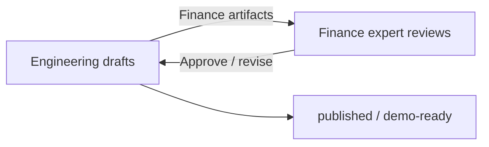

# Expert Review Workflow — Finance Expert ↔ Engineering

**Version:** 1.1  
**Purpose:** Define who drafts what, who approves what, and how finance vs engineering workstreams split.  
**Credentials:** [EXPERT_CREDENTIALS.md](./EXPERT_CREDENTIALS.md)

---

## Roles

| Role | Person | Credential | Owns |
|------|--------|------------|------|
| **Chief Developer** | Engineering (AI agent + eng team) | — | Architecture, schemas, scripts, verifier logic, trajectory capture |
| **Finance lead reviewer** | Gaurav Goyal | CFA Level III candidate | Ground truth accuracy, judgment rubrics, PM dialogue realism, publish approval |
| **Associate** | Gaurav Goyal | CFA Level III candidate | First drafts, adjudication support, task packages under lead direction |

**Note:** Lead and associate are currently the same person (solo expert pipeline). Charterholder co-signer slot open for external "CFA-reviewed" branding if needed later.

---

## Golden rule

> **Finance content:** Engineering drafts first pass → finance expert reviews → **expert-reviewed** status required before `published`.  
> **Code / architecture:** Engineering owns end-to-end → finance expert informed, not blocking, unless it affects scoring semantics.

Do **not** label external artifacts **CFA-approved** unless a **charterholder** is named in the sign-off block.

---

## Workstream split



### Engineering owns (no finance gate for merge)

- Repo structure, scripts, CI, schemas
- Tool backends, episode runners, trace format
- Deterministic verifiers (math, section recall, timeout rules)
- Roadmap, backlog, architecture docs
- Demo trace *generation* machinery

### Finance expert must sign off before external use

- Ground truth numbers and citations (Track A)
- Gold keys and judgment rubrics (Track B)
- PM dialogue plausibility and branch triggers
- Defense rubric criteria (Outcome judgment half)
- Any task/episode marked `published` or shown to labs

### Joint (Eng drafts, finance expert validates scoring intent)

- Anti-patterns list
- Valid adjusted EPS / acceptable answer sets
- Layer weights and penalty severity
- Calibration sample adjudication (κ ≥ 0.7)

---

## Artifact lifecycle

| Status | Meaning | Who can set |
|--------|---------|-------------|
| `draft` | Eng or associate first pass | Eng |
| `pending_expert_review` | Ready for finance review | Eng |
| `expert_revisions_requested` | Expert found issues | Finance expert |
| `expert_reviewed` | Approved for benchmark/env demo | Finance expert |
| `published` | Same as expert_reviewed; public index | Finance expert |
| `deprecated` | Superseded | Finance expert + Eng |

Legacy status values (`pending_cfa_review`, `cfa_approved`) may appear in older JSON — treat as equivalent to above.

---

## Review queue (current)

| ID | Artifact | Location | Eng status | Expert action |
|----|----------|----------|------------|---------------|
| REV-01 | GOOGL Q1 2026 ground truth | [expert_drafts/GOOGL_GT_REVIEW.md](./expert_drafts/GOOGL_GT_REVIEW.md) | **Expert-reviewed** (2026-07-01) | Gaurav Goyal (CFA L3 candidate) |
| REV-02 | Solaris gold key | [expert_drafts/SOLARIS_GOLD_KEY_REVIEW.md](./expert_drafts/SOLARIS_GOLD_KEY_REVIEW.md) | **Expert-reviewed** (v1.0, 2026-07-01) | Structural traps approved |
| REV-03 | Solaris corpus narrative | `env_v1/corpus/solaris_bundle_v1.json` | Draft | Disclosure realism, internal consistency |
| REV-04 | Defense rubric | [expert_drafts/DEFENSE_RUBRIC_REVIEW.md](./expert_drafts/DEFENSE_RUBRIC_REVIEW.md) | **Expert-reviewed** (2026-07-01) | v1.1.1 — Epistemic Baseline stack |
| REV-05 | PEP FX organic growth | [expert_drafts/PEP_FX_GT_REVIEW.md](./expert_drafts/PEP_FX_GT_REVIEW.md) | Draft | Pending filing verification |

---

## Review process (per artifact)

1. **Eng** produces draft in `docs/expert_drafts/` or updates JSON with `status: pending_expert_review`.
2. **Finance expert** reviews using checklist in draft doc; comments inline or in issue/sheet.
3. **Eng** applies non-substantive fixes; substantive changes loop to step 2.
4. **Finance expert** sets `expert_reviewed` + sign-off date and credential line in draft doc.
5. **Eng** copies approved gold key to local `gold_keys/` (gitignored) if private.

---

## What finance expert should check

### Track A — footnote / forensics task

- [ ] Period correct (Q1 2026 vs FY confusion traps)
- [ ] Segment numbers match primary SEC filing
- [ ] Reconciling items complete (nothing omitted)
- [ ] Trap design is fair (common failure mode, not gotcha)
- [ ] No investment recommendation required (Type F)

### Track B — dual-control episode

- [ ] Gold key numbers match corpus bundle
- [ ] PM branches are plausible for a real desk conversation
- [ ] Valid EPS set matches economic reasoning
- [ ] Failure modes map to real analyst mistakes

---

## Communication template (expert feedback)

```
Artifact: [REV-XX / task_id]
Reviewer: Gaurav Goyal (CFA Level III candidate)
Verdict: [approve | revise | reject]

Checklist:
- [ ] Numbers verified against [filing / corpus doc]
- [ ] ...

Required changes:
1. ...

Sign-off: [expert_reviewed | pending]
```
