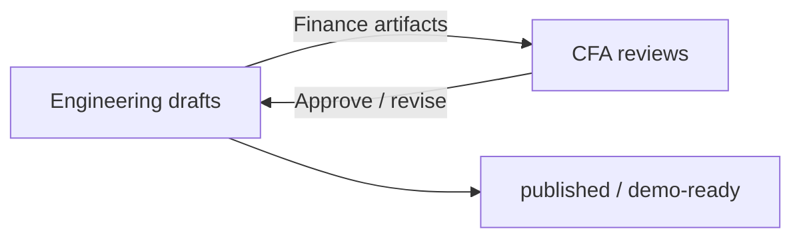

# Expert Review Workflow — CFA ↔ Engineering

**Version:** 1.0  
**Purpose:** Define who drafts what, who approves what, and how finance vs engineering workstreams split.

---

## Roles

| Role | Person | Owns |
|------|--------|------|
| **Chief Developer** | Engineering (AI agent + eng team) | Architecture, schemas, scripts, verifier logic, trajectory capture |
| **CFA Expert** | You | Ground truth accuracy, judgment rubrics, PM dialogue realism, publish approval |
| **Associate** | MBA/analyst (future) | First drafts under CFA direction |

---

## Golden rule

> **Finance content:** Engineering drafts first pass → CFA reviews → CFA sign-off required before `published`.  
> **Code / architecture:** Engineering owns end-to-end → CFA informed, not blocking, unless it affects scoring semantics.

---

## Workstream split



### Engineering owns (no CFA gate for merge)

- Repo structure, scripts, CI, schemas
- Tool backends, episode runners, trace format
- Deterministic verifiers (math, section recall, timeout rules)
- Roadmap, backlog, architecture docs
- Demo trace *generation* machinery

### CFA must sign off before external use

- Ground truth numbers and citations (Track A)
- Gold keys and judgment rubrics (Track B)
- PM dialogue plausibility and branch triggers
- Defense rubric criteria (Outcome judgment half)
- Any task/episode marked `published` or shown to labs

### Joint (Eng drafts, CFA validates scoring intent)

- Anti-patterns list
- Valid adjusted EPS / acceptable answer sets
- Layer weights and penalty severity
- Calibration sample adjudication (κ ≥ 0.7)

---

## Artifact lifecycle

| Status | Meaning | Who can set |
|--------|---------|-------------|
| `draft` | Eng or associate first pass | Eng |
| `pending_cfa_review` | Ready for expert review | Eng |
| `cfa_revisions_requested` | Expert found issues | CFA |
| `published` | Approved for benchmark/env demo | CFA |
| `deprecated` | Superseded | CFA + Eng |

Files: `status` field in task JSON, episode JSON, or gold key.

---

## Review queue (current)

| ID | Artifact | Location | Eng status | CFA action |
|----|----------|----------|------------|------------|
| REV-01 | GOOGL Q1 2026 ground truth | [expert_drafts/GOOGL_GT_REVIEW.md](./expert_drafts/GOOGL_GT_REVIEW.md) | **Approved** (2026-07-01) | Published; grader rubric + failure classifier live |
| REV-02 | Solaris gold key | [expert_drafts/SOLARIS_GOLD_KEY_REVIEW.md](./expert_drafts/SOLARIS_GOLD_KEY_REVIEW.md) | **Approved** (v1.0, 2026-07-01) | v1.1 enhancements → P1-14 |
| REV-03 | Solaris corpus narrative | `env_v1/corpus/solaris_bundle_v1.json` | Draft | Disclosure realism, internal consistency |
| REV-04 | Defense rubric | [expert_drafts/DEFENSE_RUBRIC_REVIEW.md](./expert_drafts/DEFENSE_RUBRIC_REVIEW.md) | **Pending CFA** (2026-07-01) | PM engagement criteria; v3 evidence attached |

---

## Review process (per artifact)

1. **Eng** produces draft in `docs/expert_drafts/` or updates JSON with `status: pending_cfa_review`.
2. **CFA** reviews using checklist in draft doc; comments inline or in issue/sheet.
3. **Eng** applies non-substantive fixes; substantive changes loop to step 2.
4. **CFA** sets `published` + sign-off date in artifact or draft doc.
5. **Eng** copies approved gold key to local `gold_keys/` (gitignored) if private.

---

## What CFA should check (finance)

### Track A — footnote / forensics task

- [ ] Period correct (Q1 2026 vs FY confusion traps)
- [ ] Segment numbers match primary SEC filing
- [ ] Reconciling items complete (nothing omitted)
- [ ] Sign conventions (losses negative)
- [ ] Citations: doc_id, note, table
- [ ] No Buy/Sell language on Type F

### Track B — dual-control episode

- [ ] Reported vs adjusted EPS arithmetic
- [ ] Binary item truly binary (sale-leaseback)
- [ ] Contested item truly contested (R&D credit + prior years)
- [ ] Valid answer set complete ($1.20 and $1.24 paths)
- [ ] PM pushback realistic for buy-side
- [ ] Consensus methodology note plausible

---

## What Engineering checks (technical)

- [ ] L1 script passes on ground truth
- [ ] Scorer reproducible on fixed traces
- [ ] Gold key not committed to git
- [ ] Trace schema valid
- [ ] Turn budget / timeout behavior matches spec

---

## Cadence

| Meeting | Frequency | Focus |
|---------|-----------|-------|
| Review sync | Weekly | Clear REV-* queue |
| Calibration | Per campaign | 10–20% adjudication sample |
| Publish gate | Per task/episode | Before lab or client demo |

---

## Communication template (CFA feedback)

```markdown
## REV-XX — [Artifact name]
**Reviewer:** [name]  
**Date:** YYYY-MM-DD  
**Verdict:** approve | revise

### Correct
- ...

### Must fix
- ...

### Optional
- ...
```
