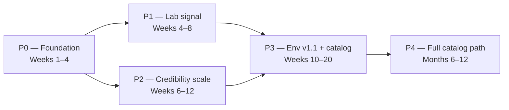

# Zstate Equity Research — Unified Roadmap

**Version:** 0.3  
**Last updated:** July 2026  
**Horizon:** 12 months (pilot → lab signal → scale)

Single roadmap for the **public eval benchmark** and the **dual-control RL environment** (AlphaNote-Bench). Both share expert pipeline, corpus philosophy, and trajectory/reward product path.

---

## North star

> Credentialed experts + fixed filing corpus + auditable trajectories + exposed verifiers → **training-grade reward signal** for equity research agents.

**Lab pitch:** One runnable dual-control environment with 4-component composite reward (Outcome / Grounding / Defense / Hallucination).  
**Public credibility:** 3–5 single-turn eval tasks on real SEC filings + leaderboard.

---

## Product tracks (parallel, not sequential)

| Track | Product | Audience | Primary artifact |
|-------|---------|----------|------------------|
| **A — Eval benchmark** | AlphaNote-Bench public MVD | Credibility, corpus proof, fracture taxonomy | `benchmark_v0.1/` → 15 tasks (3–5 first) |
| **B — RL environment** | Dual-control env v1 | AI labs (RLVR / SFT trajectories) | `env_v1/` — Solaris episode + verifier |
| **C — Training export** | Trajectory dataset | Zstate Phase 2 product | Curated JSONL + reward vectors |

Track B is the **lab conversation**. Track A proves **authoring at scale**. Track C monetizes both.

---

## Phase map

---

## P0 — Foundation (Weeks 1–4)

**Goal:** Shared infrastructure both tracks can use.

| Milestone | Deliverable | Owner | Exit criteria |
|-----------|-------------|-------|---------------|
| Corpus v0 | EDGAR ingest + section index for 5 pilot tickers | Eng | Manifest with checksums |
| GOOGL pilot sign-off | Type F reference task published | CFA + Associate | L1 script passes; peer review |
| env_v1 scaffold | Tool backend, episode spec, PM FSM, scorer stub | Eng | `score_episode.py` runs on sample trace |
| Expert pipeline | Named CFA lead + associate; authoring SOP | Product | First Solaris gold key drafted |
| Docs | Roadmap + backlog (this file) | Eng | Team aligned on P0/P1 split |

**Reuse from earlier research:** task JSON schema, ground truth pattern, gold paths, anti_patterns, 3-layer reward vocabulary, fracture codes, calibration protocol (κ ≥ 0.7).

---

## P1 — Lab signal (Weeks 4–8)

**Goal:** Runnable demo for AI lab conversations.

| Milestone | Deliverable | Exit criteria |
|-----------|-------------|---------------|
| Solaris corpus bundle | Fictional 10-Q, transcript, consensus, prior-year footnotes | All 6 tools return consistent excerpts |
| PM policy v1 | Scripted FSM (opening + follow-ups A/B/C) | Branch triggers on agent message features |
| Verifier v1 | 4-component scorer; binary sale-leaseback + grounding rules | 3 demo trajectories with exposed sub-scores |
| `run_episode.py` | Agent adapter + turn budget + trace JSONL | One frontier model completes episode end-to-end |
| Methodology note | Anti-hacking, calibration loop, public/private split | Review-ready PDF/MD for labs |
| Demo package | good / partial / timeout traces + reward breakdown | Lab can replay without Zstate eng |

**Success metrics:**

- Composite reward reproducible on fixed trace (deterministic components)
- 10–20% adjudication sample protocol documented
- Timeout caps Outcome at 0.5 if no `submit_recommendation`

**Defer:** LLM-PM (use FSM v1); real-ticker episode; 15 MVD tasks.

---

## P2 — Credibility scale (Weeks 6–12, overlaps P1)

**Goal:** Public benchmark proves expert pipeline — not the lab headline.

| Milestone | Deliverable | Exit criteria |
|-----------|-------------|---------------|
| MVD core (3–5 tasks) | GOOGL + 1 guidance + 1 FX or footnote | All have GT, gold path, L1 script |
| First agent campaign | 2 models × core tasks × 3 runs | Fracture report with ≥8 codes |
| Leaderboard v0 | Median scores + component breakdown | Published in `benchmark_v0.1/results/` |
| Trajectory export v0 | JSONL schema aligned with env_v1 traces | Same fields: tools, sections, rewards |

**Cap MVD at 3–5 tasks until env_v1 demo is done** — CFA hours are binding.

---

## P3 — Env v1.1 + benchmark scale (Weeks 10–20)

**Goal:** Second scenario + expand public tasks using proven templates.

| Milestone | Deliverable | Notes |
|-----------|-------------|-------|
| Guidance dispute env | Scenario #2 (NFLX-style guidance vs actuals + PM) | Reuse env_v1 shell |
| Real-ticker episode | PEP or KO earnings-quality on authored excerpts | Stronger domain signal |
| MVD → 15 tasks | 5 cos × 3 archetypes | Only after ≤6 hrs/task proven |
| LLM-judge calibration | Defense + Outcome (judgment) with expert panel | Adjust rubric thresholds |
| PM policy v2 | Optional LLM paraphrase layer on FSM | After branch miss rate measured |

**New archetype added to catalog:** `earnings_quality_dispute` (dual-control).

---

## P4 — Full catalog path (Months 6–12)

**Goal:** Roadmap to 185 tasks and Type C — gated on market data tier.

| Release | Tasks | Adds |
|---------|-------|------|
| v0.1b | 45 | Scale MVD to 15 companies |
| v0.2 | +15 | 3-statement mini-model bundles |
| v0.3 | +15 | DCF + comps (**market data tier**) |
| v0.4 | +30 | LBO, SOTP, DDM |
| v0.5 | +20 | Type C initiation + **Scenario #3 thesis pushback** |
| Env v2 | — | Long-horizon tool execution (Toolathlon-style) |

**185-task catalog** remains internal north star — not a lab deliverable.

---

## Scoring model alignment

| Public benchmark (Track A) | RL environment (Track B) |
|----------------------------|----------------------------|
| L1 — Hard accuracy | Outcome (binary half) |
| L2 — Section recall + judgment rules | Outcome (judgment) + Grounding + Defense |
| L3 — Citations + trust | Hallucination penalty |
| 3-layer weights by task type (F/M) | Fixed 0.45 / 0.25 / 0.20 / −0.10 |

Same philosophy; env exposes **four sub-scores** for lab interpretability.

---

## Public vs private artifacts

| Public | Private |
|--------|---------|
| Task briefs, tool backend excerpts (redacted) | Gold keys, full PM scripts |
| Leaderboard, fracture taxonomy | Defense rubric LLM-judge prompts |
| Methodology overview | Expert adjudication sheets |
| 3–5 benchmark tasks | Full env verifier source (lab license) |

---

## Dependencies & risks

| Risk | Mitigation |
|------|------------|
| CFA pool is binding constraint | P1 env before P2 MVD scale; tiered authoring (expert writes case, second adjudicates) |
| MVD mistaken for lab product | External messaging: benchmark + env, not benchmark alone |
| PM script OOD (agent surprises) | Log `PM_OOD` fractures; fallback PM utterance |
| Reward hacking | Grounding + Defense required; Outcome alone insufficient |
| Gold key contamination | `gold_keys/` gitignored; example template in `gold_keys.example/` |

---

## Document index

| Doc | Purpose |
|-----|---------|
| [Architecture](./ARCHITECTURE.md) | Repo structure, tracks A/B/C, scoring map |
| [Expert review workflow](./EXPERT_REVIEW_WORKFLOW.md) | CFA ↔ eng handoff |
| [Framework v0.2](./ZSTATE_EQUITY_RESEARCH_BENCHMARK_FRAMEWORK.md) | MVD design, 3-layer reward, task types |
| [Backlog](./BACKLOG.md) | Prioritized work items |
| [env_v1 spec](../env_v1/docs/dual_control_spec_v1.md) | Dual-control RL environment v1 |
| [Task catalog](./EQUITY_RESEARCH_BENCHMARK_TASK_CATALOG.md) | 185-task workflow map |
