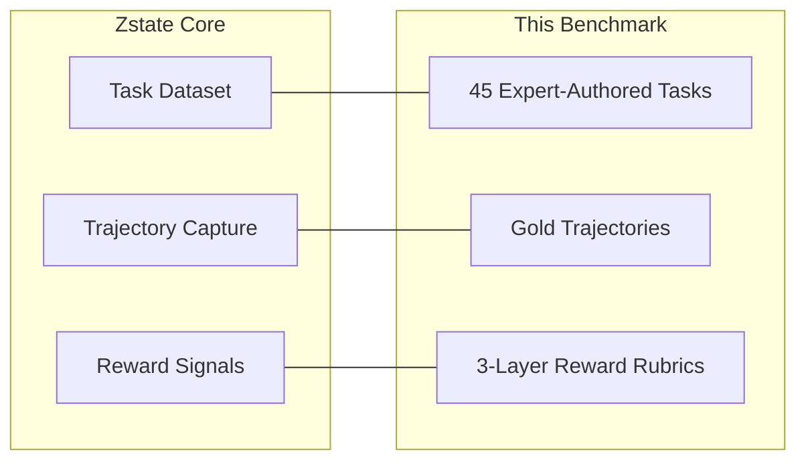
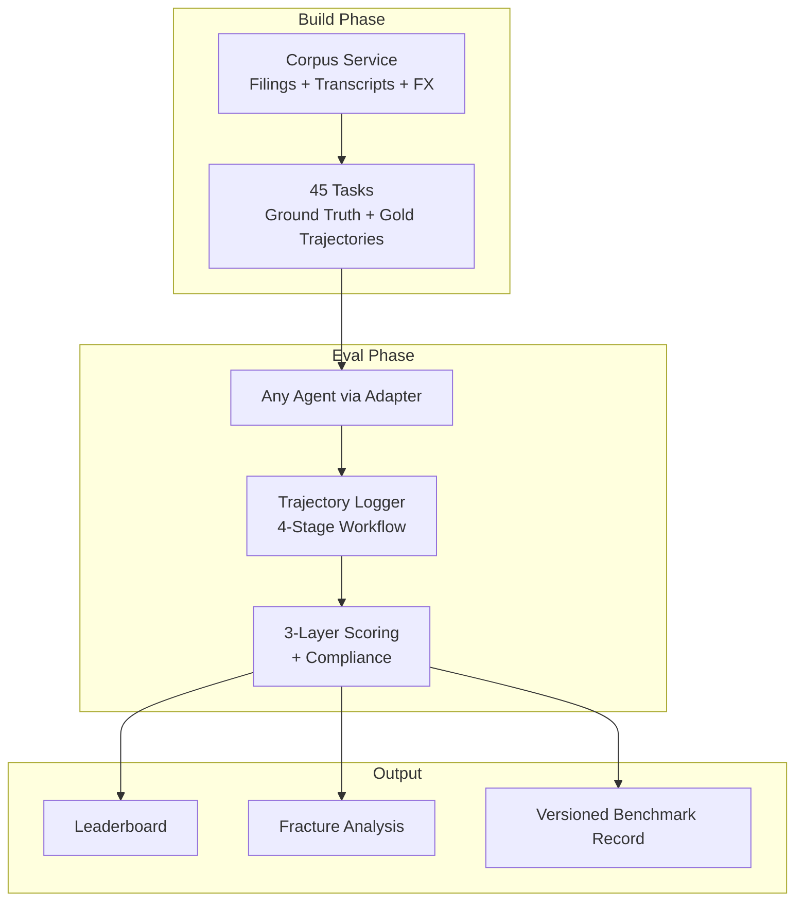
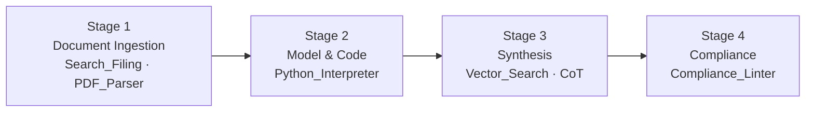
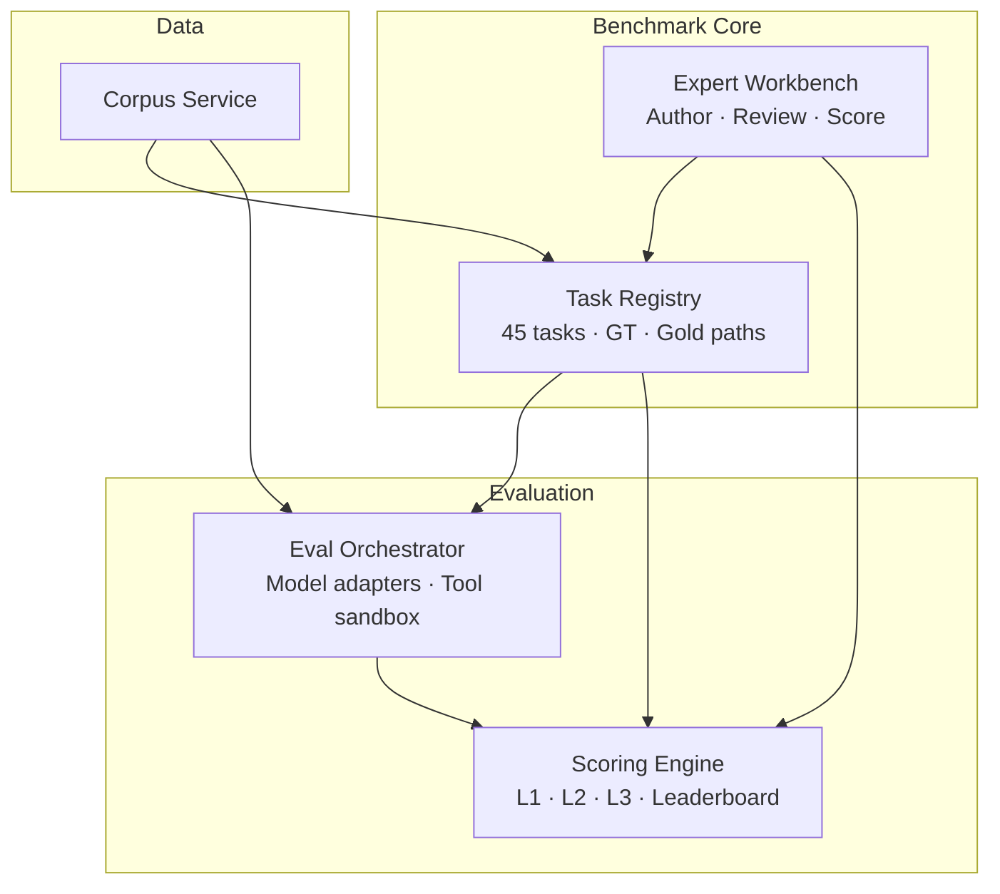
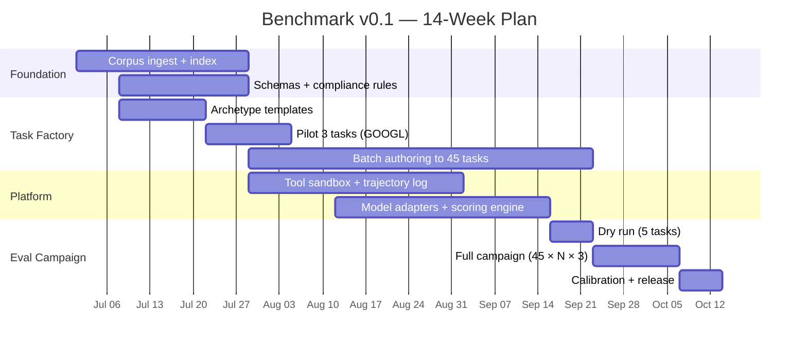

# Zstate Equity Research Agent Benchmark
## Framework Proposal — v0.1

**Prepared for:** Zstate.ai  
**Date:** June 2025  
**Status:** Design complete — ready for review  
**Scope:** Minimum Viable Benchmark (MVD) — eval-first, 45 tasks, 15 companies

---

## Executive Summary

Zstate builds **agentic AI datasets** — Task, Trajectory, and Reward loops — using **credentialed domain experts**, not generic crowd labor. A standard text-in/text-out Q&A benchmark cannot measure what enterprise equity research clients actually need: **judgment**, **multi-step tool use**, and **auditable reasoning** across long-horizon financial workflows.

This document proposes an **enterprise-grade equity research agent benchmark** designed specifically for Zstate's architecture. It evaluates AI agents on real regulatory filings (10-K, 10-Q, earnings transcripts), quantitative modeling via code execution, narrative synthesis, and regulatory compliance — with every score backed by programmatic checks and expert-validated rubrics.

**What we're proposing to build first:** A versioned **benchmark suite** (`benchmark_v0.1`) — 45 tasks, model-agnostic evaluation, 3-run variance study, and a leaderboard — before expanding into training trajectory curation.

> **Detailed task backbone:** The MVD starts with 45 eval units, but the full senior-analyst workflow decomposes into **184+ micro-tasks** across data ingestion, financial models (3-statement, DCF, comps, LBO, SOTP, DDM), earnings workflow, thesis, and compliance. See the [Exhaustive Task Catalog](./EQUITY_RESEARCH_BENCHMARK_TASK_CATALOG.md).

| Parameter | Decision |
|-----------|----------|
| Pilot universe | 15 companies across 3 sectors (Tech, Media, Consumer) |
| Task count | 45 (3 archetypes × 15 companies) |
| Eval runs | 3 per task per model (median aggregation) |
| Models | Model-agnostic — any tool-using agent via adapter |
| Expert capacity | 20–30 hrs/week (CFA lead + MBA associate) |
| Compliance | FINRA baseline + 3 client mandate profiles |
| Data | Greenfield — SEC EDGAR + Transcript API (IR fallback) |
| Output | Benchmark / eval dataset first; training loops in Phase 2 |

---

## Why This Fits Zstate



| Zstate Principle | How This Benchmark Delivers |
|------------------|----------------------------|
| **Credentialed experts, not crowds** | CFA/MBA authors tasks, ground truth, gold trajectories, and Layer 2 rubrics |
| **Task construction** | 3 real-world archetypes grounded in SEC filings — not synthetic trivia |
| **Agentic trajectories** | Full tool-call logging across 4-stage long-horizon workflow |
| **Multi-layered rewards** | Hard accuracy + expert judgment + trust/compliance — not a single BLEU score |
| **Enterprise-grade** | FINRA linter, client mandate profiles, citation audit, uncertainty calibration |

---

## Framework Overview

The benchmark is a closed evaluation loop:



---

## Pilot Universe

### Three Sectors — Fifteen Companies

| Sector | Companies | Representative Complexity |
|--------|-----------|---------------------------|
| **Technology** | Alphabet, Amazon, Meta, Microsoft, Apple | Capitalized R&D, stock comp, cloud segment reclassification, FX on international revenue |
| **Media** | Netflix, Disney, WBD, Comcast, Spotify | Content amortization, DTC vs legacy, subscriber guidance drift, IP impairment |
| **Consumer** | PepsiCo, McDonald's, Coca-Cola, Starbucks, Mondelez | Franchise models, commodity costs, geographic FX, promotional normalization |

### Task Matrix — 45 Tasks

Each company receives **one task per archetype**:

| Archetype | Count | What It Tests |
|-----------|-------|---------------|
| **Footnote Reconciliation** | 15 | Cross-reference segment tables against ambiguous footnote disclosures |
| **Guidance Drift** | 15 | Compare earnings call guidance to subsequent 10-Q actuals |
| **Cross-Border / FX Model** | 15 | Build constant-currency organic growth using weighted-average FX rates |

**Example (Alphabet — Footnote Reconciliation):**  
Reconcile Google Cloud vs Google Services revenue in the segment breakdown against a reclassification described only in Note 2 (Significant Accounting Policies). Quantify any discrepancy. Agent must navigate to the segment table *and* the footnote — not just the income statement headline.

**Example (Netflix — Guidance Drift):**  
Cross-reference Q2 management commentary on content amortization against actual cash content spend and amortization in Q3/Q4 10-Qs.

**Example (PepsiCo — Cross-Border FX):**  
Build organic constant-currency revenue growth for Europe, AMESA, and APAC segments using weighted-average exchange rates — not spot rates.

---

## Four-Stage Agent Workflow

Every task evaluates agents across a **long-horizon workflow**, not a single prompt-response:



| Stage | Agent Must Do | What We Measure |
|-------|---------------|-----------------|
| **1 — Ingestion** | Locate precise filing sections; avoid loading entire documents | Section targeting precision; context bloat ratio |
| **2 — Modeling** | Extract metrics; build 3-statement model / DCF in Python; verify A = L + E | Code execution vs mental math; sign conventions |
| **3 — Synthesis** | Connect numbers to investment thesis; justify assumptions with bounds | Reasoning quality; forecast discipline; peer context |
| **4 — Compliance** | Format investment memo; flag unverified data; pass compliance lint | FINRA alignment; mandate rules; uncertainty calibration |

**Gold trajectories:** Credentialed experts pre-map the optimal tool path for each task — which sections to read, what Python to run, how to structure the answer. Agent trajectories are scored against this baseline.

---

## Three-Layer Reward Model

Responses are scored across three distinct layers — programmatic checks mixed with expert validation:

### Layer 1 — Technical & Tabular Accuracy (40%)

*The "Hard" Reward — fully automated where possible*

| Metric | Pass | Fail | Weight |
|--------|------|------|--------|
| Data extraction | Values match filing tables exactly | Annualized vs quarterly confusion | High |
| Sign & directionality | Outflows negative in cash calcs | CapEx positive → inflated FCF | **Critical** |
| Math precision | Within ±0.01% of Python verification | Formula / rounding errors | Medium |

Critical sign errors → **automatic zero**.

### Layer 2 — Domain Reasoning & Judgment (35%)

*The "Expert" Reward — credentialed analyst rubric*

| Dimension | High (4–5) | Poor (1–2) |
|-----------|------------|------------|
| Contextual awareness | Normalizes non-recurring items (divestitures, litigation) | Accepts headline GAAP blindly |
| Forecast bounding | WACC / multiples bounded by peer averages | Tech multiples on industrial stock |
| Footnote utilization | Trajectory shows Commitments / Contingencies read | Summary statements only |

Scored via trajectory diff (automated) + expert-assisted rubric (human confirm/override).

### Layer 3 — Traceability & Enterprise Safety (25%)

*The "Trust" Reward — audit and compliance*

| Metric | Pass | Fail |
|--------|------|------|
| Source grounding | Every metric → `{doc_id, page, snippet}` | Broad or missing citation |
| Uncertainty calibration | Flags gaps; does not interpolate | Fills gaps with fake trends |
| Compliance | Fact/opinion split + disclosures | Guaranteed return language |

**FINRA fail → hard veto (score = 0).**  
**Mandate fail → score capped at 0.30.**

### Three-Run Aggregation

Each task × model is run **3 times**. Reported score = **median**. Layer 3 compliance = **worst run wins**. Fracture codes unioned across runs.

---

## Compliance Architecture

### FINRA Baseline (Universal)

Applied to every task — 6 core rules covering guaranteed returns, fact/opinion separation, risk disclosures, advice framing, and data limitations.

### Client Mandate Profiles (Task-Level)

Simulates real portfolio constraints. One profile per task:

| Profile | Simulates | Key Constraint |
|---------|-----------|----------------|
| **Long-Only Equity** | Standard mutual fund / long-only mandate | No short-selling language |
| **Conservative Income** | Dividend / retirement portfolios | Dividend sustainability must be addressed |
| **No Speculative Language** | Fiduciary / conservative committees | Forecast assumptions must be bounded and cited |

~15 tasks per profile across the 45-task set.

---

## Platform Components

Five integrated services comprise the benchmark platform:



| Component | Purpose | MVD Deliverable |
|-----------|---------|-----------------|
| **Corpus Service** | SEC filings, transcripts (API + IR fallback), FX rates, section index | `corpus_v1` manifest (~210 docs) |
| **Task Registry** | 45 tasks with ground truth, gold trajectories, mandate attachment | `benchmark_v0.1` manifest |
| **Expert Workbench** | CFA/MBA authoring, review, corpus QA, Layer 2 scoring UI | 45 published tasks |
| **Eval Orchestrator** | Model-agnostic agent runs, tool sandbox, trajectory capture | Eval campaign (45 × N × 3 runs) |
| **Scoring Engine** | 3-layer rewards, FINRA + mandate linter, leaderboard | Leaderboard + fracture report |

Detailed technical specifications: `docs/specs/` (Corpus Service, Task Registry, Eval Orchestrator, Scoring Engine, Expert Workbench).

---

## Data Strategy

| Asset | Source | Method |
|-------|--------|--------|
| 10-K / 10-Q | SEC EDGAR | Automated fetch |
| Earnings transcripts | Transcript API | **Primary (Option B)** |
| Transcript fallback | Company IR pages | **Fallback (Option A)** — when API gaps or expert mismatch |
| FX rates | FRED / Treasury | Reference table for cross-border tasks |

Every document carries full provenance: `doc_id`, checksum, source URL, acquisition method. Corpus locked via manifest checksum before benchmark release. IR official text wins on citation conflict with API.

---

## Expert Model

Zstate's credentialed expert advantage operationalized:

| Role | Hours/week | Responsibility |
|------|-----------|----------------|
| Lead CFA | 10–12 | Task standards, rubric anchors, publish approval, corpus sign-off |
| MBA Associate | 12–15 | Draft tasks, ground truth, gold trajectories, citations |
| Compliance (shared) | 3–5 | FINRA/mandate rules, Layer 3 spot-check |

**Throughput:** 4–5 tasks/week → 45 tasks in 10–12 weeks.

**Pilot batch:** 3 Alphabet tasks (one per archetype) in Weeks 3–4 to calibrate templates before scaling.

---

## Implementation Timeline



| Phase | Weeks | Key Output |
|-------|-------|------------|
| **Foundation** | 1–4 | Corpus v1 locked; schemas; compliance rules |
| **Task Factory** | 3–12 | 45 published tasks with ground truth + gold trajectories |
| **Platform** | 5–12 | Tool sandbox, adapters, scoring engine, expert workbench |
| **Eval Campaign** | 11–14 | Full model runs, leaderboard, fracture analysis, `benchmark_v0.1` release |

---

## MVD Deliverables — `benchmark_v0.1`

```
benchmark_v0.1/
├── manifest.json                 # 45 tasks, corpus checksums, rubric version
├── tasks/                        # 45 task specs
├── ground_truth/                 # 45 expert-verified answer packages
├── gold_trajectories/            # 45 optimal tool paths
├── rubrics/
│   ├── layer1_rules.json
│   ├── layer2_anchors.json
│   ├── finra_v1.json
│   └── mandate_profiles/
├── corpus/
│   └── corpus_v1_manifest.json   # ~210 docs, checksum-locked
└── results/
    └── campaign_001/
        ├── trajectories/         # 45 × N × 3 runs
        ├── scores/               # Reward vectors
        └── leaderboard.json
```

---

## Success Metrics

| Metric | Target |
|--------|--------|
| Task coverage | 45 tasks, 3 archetypes, 3 sectors, 15 companies |
| Ground truth citation rate | 100% numeric claims cited |
| Layer 1 automation | ≥80% claims programmatically scorable |
| Expert inter-rater agreement (Layer 2) | Cohen's κ ≥ 0.7 on calibration set |
| Model score discrimination | ≥15pt spread between best/worst Tier A model |
| Trajectory completeness | 100% runs with full tool I/O logged |
| Citation audit (best model) | ≥90% metrics fully grounded |
| Fracture taxonomy | ≥10 distinct failure codes observed |
| Compliance | FINRA + 3 mandate profiles operational |

---

## Fracture Taxonomy (Eval Insight)

Running frontier agents through the benchmark produces a **fracture map** — where and why agents break:

| Code | Failure Mode | Typical Stage |
|------|-------------|---------------|
| `LOOP_TOOL` | Infinite tool call loops on large tables | 1 |
| `BLOAT_CTX` | Loads entire filing vs targeted sections | 1 |
| `NO_CODE` | Skips Python for complex math | 2 |
| `SIGN_ERR` | Reverses cash flow signs | 2 |
| `HALLUC_FILL` | Interpolates missing data | 3 |
| `CITE_BROAD` | Non-auditable citations | 3 |
| `COMPLIANCE_FAIL` | FINRA/mandate violations | 4 |

This taxonomy calibrates reward weights and identifies which tasks are most discriminative — core value for model developers and enterprise buyers.

---

## Phase 2 Roadmap (Post-MVD)

| Capability | Description |
|------------|-------------|
| Training trajectories | Curate expert-ranked agent paths for SFT / RL |
| Preference pairs | Better vs worse trajectories on same task |
| Difficulty tiers | L1 / L2 / L3 task grading |
| Expanded universe | 50+ companies, banking sector, ESG mandates |
| Continuous refresh | Quarterly corpus update pipeline |
| Reward model | Train on 3-layer signals |

---

## What Exists Today

| Artifact | Status | Location |
|----------|--------|----------|
| Framework proposal (this document) | ✅ Complete | `docs/ZSTATE_EQUITY_RESEARCH_BENCHMARK_FRAMEWORK.md` |
| Corpus Service spec | ✅ Complete | `docs/specs/corpus-service.md` |
| Task Registry spec | ✅ Complete | `docs/specs/task-registry.md` |
| Eval Orchestrator spec | ✅ Complete | `docs/specs/eval-orchestrator.md` |
| Scoring Engine spec | ✅ Complete | `docs/specs/scoring-engine.md` |
| Expert Workbench spec | ✅ Complete | `docs/specs/expert-workbench.md` |
| Implementation / code | ⬜ Not started | Greenfield |

---

## Recommended Next Steps

1. **Review this framework** — Confirm scope, archetypes, pilot universe, and compliance model align with Zstate product strategy.
2. **Confirm expert resourcing** — CFA lead + MBA associate availability (20–30 hrs/week).
3. **Select transcript API vendor** — Week 1 decision; IR fallback documented.
4. **Approve 14-week timeline** — Or adjust scope (e.g., 20 tasks first tranche).
5. **Begin Sprint 0** — Corpus ingest for 15 tickers + GOOGL pilot task authoring.

---

## Appendix — Document Index

| Document | Audience | Content |
|----------|----------|---------|
| **This framework** | Zstate leadership, product, partners | Executive overview, architecture, timeline |
| [Exhaustive Task Catalog](./EQUITY_RESEARCH_BENCHMARK_TASK_CATALOG.md) | Domain experts, product | 184+ micro-tasks: data → models → valuation → thesis |
| `docs/specs/corpus-service.md` | Platform engineering | EDGAR/transcript ingest, API contract, fallback state machine |
| `docs/specs/task-registry.md` | Task engineering + experts | Task schemas, 45-task matrix, lifecycle |
| `docs/specs/eval-orchestrator.md` | Platform engineering | Model adapters, tool sandbox, 3-run campaigns |
| `docs/specs/scoring-engine.md` | Platform + experts | 3-layer rubrics, aggregation, compliance linter |
| `docs/specs/expert-workbench.md` | Domain experts + product | Authoring UI, review workflow, Layer 2 scoring |

---

*Prepared as a design proposal for Zstate.ai — Equity Research Agent Benchmark v0.1*
