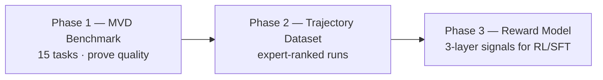
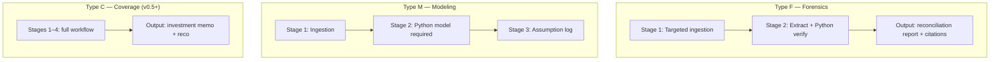
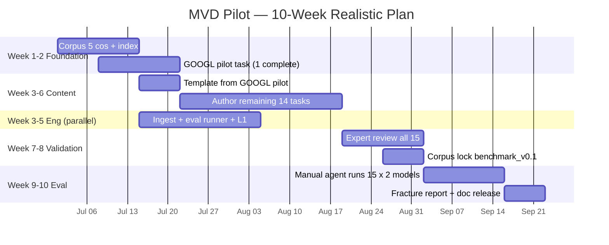

# Zstate Equity Research Agent Benchmark
## Framework Proposal — v0.2 (Revised)

**Prepared for:** Zstate.ai  
**Date:** June 2025  
**Status:** Design proposal — pilot not yet validated  
**Scope:** MVD pilot — **15 eval tasks**, 5 companies, eval-first with trajectory dataset path

> **Implementation map:** Technical structure → [ARCHITECTURE.md](./ARCHITECTURE.md). Priorities → [ROADMAP.md](./ROADMAP.md) / [BACKLOG.md](./BACKLOG.md). Dual-control RL env → [env_v1/](../env_v1/). CFA review process → [EXPERT_REVIEW_WORKFLOW.md](./EXPERT_REVIEW_WORKFLOW.md).

---

## Executive Summary

Zstate builds **agentic AI datasets** — Task, Trajectory, and Reward loops — using **credentialed domain experts**, not generic crowd labor. Standard text-in/text-out finance benchmarks (FinQA, FinanceBench, etc.) do not measure what enterprise equity research requires: **multi-step tool use**, **auditable citations**, and **judgment under real filing complexity**.

This document proposes an equity research agent benchmark aligned to Zstate's architecture. It evaluates agents on SEC filings and earnings transcripts with programmatic scoring and expert-validated rubrics — scoped to what we can **actually build and validate** in a first pilot.

### What we are building first

| Deliverable | Description |
|-------------|-------------|
| **MVD benchmark** | **15 expert-authored eval tasks** (not 45) — quality over coverage |
| **Eval record** | Task + agent trajectory + 3-layer reward vector per run |
| **Fracture report** | Where and why agents break (tool loops, sign errors, citation gaps) |
| **Path to product** | Benchmark proves task quality → **trajectory dataset for training** (Zstate core) |

### What we are explicitly not building in MVD

- Full 5-service platform (Expert Workbench, etc.) — **JSON + scripts + sheets for pilot**
- 45-company universe — **5 pilot companies first**
- FINRA compliance lint on forensics-only tasks — **compliance scoped to task type**
- Full DCF/comps/LBO stack — **requires market data; deferred to v0.3+**
- Type C coverage tasks (Buy/Hold/Sell initiation memo) — **deferred to v0.5**; requires licensed market data (Bloomberg/Refinitiv APIs), live price/consensus feeds, and FINRA-compliant recommendation workflow

> **Full analyst workflow:** 185 indexed micro-tasks (data → models → valuation → memo) in the [Task Catalog](./EQUITY_RESEARCH_BENCHMARK_TASK_CATALOG.md). MVD implements **15 eval units** from that catalog — not the full stack.

---

## Revised MVD Parameters

| Parameter | v0.1 (previous) | **v0.2 (revised)** | Rationale |
|-----------|-----------------|---------------------|-----------|
| Eval tasks | 45 | **15** | Expert hours realistic; quality over repetition |
| Pilot companies | 15 | **5** | One anchor per sector + 2 cross-sector |
| Archetypes | 3 × 15 cos | **3 × 5 cos** | Same archetypes, proven before scale |
| Workflow | 4 stages on every task | **Task-type dependent** | No fake memos on footnote tasks |
| Compliance | FINRA on all tasks | **Scoped by task type** | Forensics ≠ investment recommendation |
| Platform | 5 services, 14 weeks | **Lightweight pilot stack** | No eng team assumed |
| Expert capacity | 20–30 hrs/wk | **20–30 hrs/wk, 8–10 weeks for 15 tasks** | Honest throughput |
| Eval runs | 3 per task × model | **3 for pilot calibration; 1 at scale** | Cost control |
| Primary output | Leaderboard | **Benchmark + fracture map + trajectory export** | Training path is the product |

---

## Why This Fits Zstate

| Zstate principle | MVD delivery |
|------------------|--------------|
| **Credentialed experts** | CFA/MBA author tasks, ground truth, gold section sets |
| **Task construction** | 3 archetypes on real 10-K / 10-Q / transcripts |
| **Agentic trajectories** | Full tool-call logging per run |
| **Multi-layered rewards** | L1 hard checks + L2 judgment rules + L3 trust/citations |
| **Enterprise-grade** | Citation audit, uncertainty calibration; FINRA on coverage tasks only |

### Benchmark vs training (product path)



**Benchmark is proof, not the end product.** Zstate's differentiation is expert-validated **trajectories and rewards for model training** — not another public leaderboard alone.

---

## Competitive Context (Why Not Existing Benchmarks)

| Existing approach | Gap |
|-------------------|-----|
| **FinQA / TAT-QA** | Single-step numerical QA; no tools, no trajectories |
| **FinanceBench / FinBen** | Broader finance QA; not agentic, not ER workflow |
| **SEC filing QA datasets** | Retrieval + answer; no modeling, compliance, or multi-step workflows |
| **Generic agent benchmarks** | Not domain-grounded; no credentialed expert rubrics |

**Zstate wedge:** Real filings + **expert gold paths** + **3-layer rewards** + **trajectory export for training** — not a single accuracy number.

---

## Pilot Universe — 5 Companies

One anchor per sector, selected for filing richness and archetype fit:

| Sector | Company | Ticker | Why this name |
|--------|---------|--------|---------------|
| **Technology** | Alphabet | GOOGL | Segment reclassification, cap software, FX segments |
| **Technology** | Amazon | AMZN | AWS segments, SBC, international FX |
| **Media** | Netflix | NFLX | Content amortization, subscriber guidance drift |
| **Consumer** | PepsiCo | PEP | Geographic FX, price/volume/mix, dividends |
| **Consumer** | Coca-Cola | KO | International segments, organic growth, FX |

**Deferred from pilot (scale in v0.1b):** META, MSFT, AAPL, DIS, WBD, CMCSA, SPOT, MCD, SBUX, MDLZ — add after templates reduce authoring to ~2–3 hrs/task.

**Pilot exclusions explained:**
- **WBD** — distressed/special situation; unstable for templated tasks
- **MCD** — weak fit for FX archetype (US-heavy); use KO/PEP instead
- **Banks** — different statement structure; dedicated phase later

---

## MVD Task Matrix — 15 Tasks

Each company gets **one task per archetype**:

| Archetype | Count | Task type | What it tests |
|-----------|-------|-----------|---------------|
| **Footnote reconciliation** | 5 | **Type F** (Forensics) | Segment table ↔ footnote cross-reference |
| **Guidance drift** | 5 | **Type F + M** | Earnings call guidance vs subsequent 10-Q actuals |
| **Cross-border / FX organic growth** | 5 | **Type M** (Modeling) | Constant-currency growth via weighted-average FX |

### Task-type taxonomy (replaces universal 4-stage workflow)

Not every task needs a Buy/Hold/Sell memo. Stages are **task-type dependent**:



| Type | Stages | Tools | Output | L2 expert scoring |
|------|--------|-------|--------|-------------------|
| **F — Forensics** | 1–2 | Search_Filing, PDF_Parser, Python | Reconciliation table + narrative; **no Buy/Sell** | Automated (section recall) |
| **M — Modeling** | 1–3 | + Python required; optional Vector_Search | Model outputs + cited assumptions | Automated + spot-check |
| **C — Coverage** | 1–4 | Full stack + Compliance_Linter | Investment memo + recommendation | Expert-assisted |

**MVD uses Type F and Type M only.** Type C (full initiation memo with Buy/Hold/Sell recommendation) is **deferred to v0.5** — not because the workflow is undefined, but because it depends on **enterprise data integrations** we intentionally exclude from the SEC/transcript-only pilot: licensed market data APIs (Bloomberg, Refinitiv, or equivalent) for live prices, peer multiples, and consensus estimates; FINRA-compliant recommendation language; and client mandate profiles. Building Type C on stale or scraped market data would produce non-auditable evals and fail enterprise IT review.

### MVD task list

| # | Task ID | Company | Archetype | Type |
|---|---------|---------|-----------|------|
| 1 | GOOGL_footnote_reconciliation | Alphabet | Footnote | F |
| 2 | GOOGL_guidance_drift | Alphabet | Guidance | F |
| 3 | GOOGL_fx_organic_growth | Alphabet | FX | M |
| 4 | AMZN_footnote_reconciliation | Amazon | Footnote | F |
| 5 | AMZN_guidance_drift | Amazon | Guidance | F |
| 6 | AMZN_fx_organic_growth | Amazon | FX | M |
| 7 | NFLX_footnote_reconciliation | Netflix | Footnote | F |
| 8 | NFLX_guidance_drift | Netflix | Guidance | F |
| 9 | NFLX_fx_organic_growth | Netflix | FX | M |
| 10 | PEP_footnote_reconciliation | PepsiCo | Footnote | F |
| 11 | PEP_guidance_drift | PepsiCo | Guidance | F |
| 12 | PEP_fx_organic_growth | PepsiCo | FX | M |
| 13 | KO_footnote_reconciliation | Coca-Cola | Footnote | F |
| 14 | KO_guidance_drift | Coca-Cola | Guidance | F |
| 15 | KO_fx_organic_growth | Coca-Cola | FX | M |

### Example tasks (abbreviated)

**GOOGL — Footnote (Type F, Q1 2026):**  
Reconcile Q1 2026 segment revenues to consolidated total ($109,896M). Segment sum is $110,076M; **hedging gains (losses) of $(180)M** is not allocated to reportable segments (Note 15, 10-Q filed April 30, 2026). Trap: agents omit hedging or use +180 instead of a loss. **No price target.**

**NFLX — Guidance drift (Type F):**  
Compare Q2 management commentary on content spend/amortization to actuals in Q3/Q4 10-Q. Output: guidance vs actuals table with transcript quotes cited.

**PEP — FX organic growth (Type M):**  
Build constant-currency organic revenue growth for **EMEA** and **LatAm Foods** via MD&A additive decomposition (`reported − FX = organic`). FY2025 10-K has no WAE rate table. Output: growth table + Python verification script result.

---

## Three-Layer Reward Model (Revised Weights by Task Type)

### Layer 1 — Technical & Tabular Accuracy (*Hard*)

| Metric | Pass | Fail | Notes |
|--------|------|------|-------|
| Data extraction | Value + unit match filing | Wrong period / annualized vs quarterly | High weight |
| Sign & directionality | Outflows negative in CF calcs | CapEx positive → inflated FCF | **Critical veto** |
| Math precision | ±0.01% vs Python verification | Formula error | Medium |

### Layer 2 — Domain Reasoning (*Expert rules, not full human review every run*)

| Method | MVD approach |
|--------|--------------|
| Section recall | Did agent access required sections (e.g., Note 2, segment table)? |
| Footnote utilization | Automated vs gold **minimal section set** (not exact tool sequence) |
| Assumption bounds | Type M: growth/FX assumptions within peer/historical bounds |

**MVD:** Layer 2 is **mostly automated**. Expert scoring on **calibration set only** (5 tasks, dual-rater). Not 135 manual reviews per campaign.

### Layer 3 — Traceability & Trust

| Metric | Pass | Fail |
|--------|------|------|
| Citation completeness | Every metric → `{doc_id, page, snippet}` | Broad or missing citation |
| Uncertainty calibration | Flags gaps; no interpolation | Hallucinated fill-in |

**Citation veto:** If &lt;90% material claims cited → Layer 3 fail.

### Compliance (scoped — not on every task)

| Task type | FINRA linter | Mandate profiles |
|-----------|--------------|------------------|
| **Type F** | **Not required** | Not required |
| **Type M** | **Not required** | Optional: no_speculative_language on FX/forecast tasks |
| **Type C** | Required | Required (v0.5+) |

### Scoring weights by task type

| Type | L1 | L2 | L3 |
|------|----|----|-----|
| **F — Forensics** | 55% | 25% | 20% |
| **M — Modeling** | 50% | 30% | 20% |
| **C — Coverage** *(v0.5)* | 40% | 35% | 25% |

### Three-run aggregation (pilot)

- **Reported score:** median of 3 runs  
- **Layer 3 citations:** worst run wins (any run with &lt;90% cite rate fails)  
- **At scale (v0.1b+):** 1 run default; 3 runs for calibration tasks only  

---

## Gold Trajectories (Revised — Minimal Section Set)

**Previous approach (brittle):** One exact tool-call sequence.  
**Revised approach:** Gold = **minimal section set** + **required tool classes** + **required outputs** + **anti-patterns**.

The gold trajectory acts as a **multi-objective optimization signal** for reinforcement learning (RL), specifically rewarding **path efficiency** (minimal, targeted tool use) and **section recall accuracy** (required notes and tables accessed). Expert-validated runs that match the gold path become positive preference pairs for SFT; anti-pattern hits become explicit negative signals for the reward model.

```json
{
  "task_id": "GOOGL_footnote_reconciliation",
  "minimal_section_set": [
    "GOOGL_10K_2024_note_15",
    "GOOGL_10K_2024_note_2"
  ],
  "required_tool_classes": ["Search_Filing", "PDF_Parser", "Python_Interpreter"],
  "required_outputs": ["reconciliation_table", "citations"],
  "anti_patterns": ["load_entire_10k", "skip_accounting_policies_note"]
}
```

Valid alternative analyst paths are not penalized if section recall and outputs pass.

### Anti-patterns (required — do not omit from gold path JSON)

`anti_patterns` is **first-class schema**, not optional commentary. It gives reward-model and scoring-engine developers clear **negative signals** to train and evaluate against:

| Anti-pattern | Negative signal | Layer |
|--------------|-----------------|-------|
| `load_entire_10k` / `load_entire_10q` | Path inefficiency; context bloat | L2 (trajectory) |
| `skip_accounting_policies_note` | Section recall failure | L2 |
| `positive_180_instead_of_hedging_loss` | Sign/directionality error | L1 |
| `produce_buy_hold_sell_recommendation` | Wrong task type (Type F has no reco) | L3 / veto |

**Scoring severity:** Anti-patterns are **not** blanket hard vetoes. Most map to **Layer 2 trajectory penalties** (reduced score, still gradable). Layer 1 hits (e.g., sign errors) fail hard accuracy. Only designated Layer 3 violations (e.g., reco on a Type F task) trigger a veto.

**Implementation rule:** Every published task must ship `anti_patterns` in its gold path JSON (see [GOOGL pilot](../benchmark_v0.1/gold_paths/GOOGL_footnote_reconciliation.json)). The Scoring Engine applies layer-appropriate penalties; Phase 3 training uses hits as negative sampling signals (detail in [Task Registry](./specs/task-registry.md)).

---

## Data Strategy

| Asset | Source | MVD scope |
|-------|--------|-----------|
| 10-K / 10-Q | SEC EDGAR | Latest filed periods (e.g. FY2025 10-K, Q1 2026 10-Q) |
| Earnings transcripts | Transcript API (primary) + IR fallback | Guidance drift tasks |
| FX rates | FRED + 10-K FX note | FX tasks |
| Market data (prices, beta) | **Not in MVD** | Required for DCF/comps — v0.3+ |

**Corpus size (pilot):** ~40–60 documents (not ~210). Scale corpus with company count.

**Contamination mitigation:**
- Require snippet-level citations (not just "from 10-K")
- Prefer tasks targeting **footnote nuance** and **cross-document reconciliation**
- Holdout task variants in v0.1b (same company, different footnote)

---

## MVD Technical Stack (Lightweight — Not 5 Services)

For the pilot, avoid building the full platform. Use:

| Component | MVD implementation | Full platform |
|-----------|-------------------|---------------|
| Task storage | JSON files in repo | Task Registry API |
| Corpus | S3/local + section index (5 cos) | Corpus Service |
| Agent runs | Script + model adapter (1–2 agents) | Eval Orchestrator |
| Trajectory | JSONL step log | Trajectory Logger service |
| Scoring | Python scripts (L1, section recall) | Scoring Engine |
| Expert authoring | Google Sheet / Notion + review | Expert Workbench |
| Compliance | Rule script (Type C only later) | Compliance_Linter service |

Component specs in `docs/specs/` describe the **target architecture** — not MVD scope.

---

## Resourcing (Honest)

### Expert content (15 tasks)

| Activity | Hours/task | Total (15 tasks) |
|----------|------------|------------------|
| Task + ground truth + citations | 4–6 | 60–90 |
| Gold section set + anti-patterns | 1–2 | 15–30 |
| L1 verification script | 1–2 | 15–30 |
| Peer review | 0.5–1 | 8–15 |
| **Total expert labor** | | **~100–165 hrs** |

At **25 hrs/week → 4–7 weeks** for content (after 1 pilot task templates).

**Required:** Named CFA lead + associate (hired, contracted, or via Zstate expert network). Without this, timeline slips.

### Engineering (minimal pilot)

| Activity | Effort | Who |
|----------|--------|-----|
| EDGAR ingest + section index (5 cos) | 1–2 weeks | 1 engineer or contractor |
| Eval runner + trajectory JSONL | 1 week | Same |
| L1 scoring scripts | 1 week | Same |
| **Total eng (pilot)** | **~3–4 weeks** | Can overlap with expert work |

**Not assumed in MVD:** Full Expert Workbench, leaderboard UI, multi-model campaign automation.

---

## Revised Timeline — 10 Weeks to First Eval



| Week | Milestone | Exit criteria |
|------|-----------|---------------|
| **1–2** | Corpus for 5 cos; **1 complete task** (GOOGL footnote) | GT peer-reviewed; citations verified |
| **3** | Archetype templates from pilot | Authoring time &lt;6 hrs/task |
| **4–6** | 15 tasks authored + L1 scripts | All tasks in JSON; scripts pass on GT |
| **3–5** *(parallel)* | Eval runner + trajectory capture | 1 model completes GOOGL task end-to-end |
| **7–8** | Review + corpus lock | `benchmark_v0.1` manifest frozen |
| **9–10** | Eval campaign (2 models × 15 tasks × 3 runs) | Fracture report; median scores computed |

**Scale to 45 tasks (v0.1b):** +6–8 weeks after templates proven (not parallel with pilot).

---

## MVD Deliverables — `benchmark_v0.1`

```
benchmark_v0.1/
├── manifest.json                 # 15 tasks, corpus checksums, rubric v0.2
├── tasks/                        # 15 task specs (Type F or M)
├── ground_truth/                 # 15 expert-verified packages
├── gold_paths/                   # minimal section sets (not brittle sequences)
├── rubrics/
│   ├── layer1_rules.json
│   ├── layer2_section_recall.json
│   ├── layer3_citation.json
│   └── weights_by_task_type.json
├── corpus/
│   └── corpus_pilot_manifest.json  # 5 companies, ~40-60 docs
└── results/
    └── pilot_001/
        ├── trajectories/         # 15 × models × 3 runs
        ├── scores/
        └── fracture_report.json
```

---

## Success Metrics (MVD — Achievable)

| Metric | Target |
|--------|--------|
| Published tasks | **15** (5 cos × 3 archetypes) |
| Ground truth citation rate | 100% numeric claims cited |
| Layer 1 automation | ≥80% claims auto-scored |
| Expert calibration (5 tasks, dual-rater) | Cohen's κ ≥ 0.7 |
| Models evaluated | ≥2 via adapters |
| Score spread (best vs worst model) | ≥15 pts on median aggregate |
| Fracture taxonomy | ≥8 distinct codes observed |
| Trajectory completeness | 100% runs with tool I/O logged |
| Pilot task authoring time | ≤6 hrs/task by task 5 |

---

## Fracture Taxonomy

| Code | Failure mode | Typical type |
|------|-------------|--------------|
| `LOOP_TOOL` | Repeated tool calls on large tables | F, M |
| `BLOAT_CTX` | Full doc load vs targeted sections | F, M |
| `NO_CODE` | Skipped Python on Type M task | M |
| `SIGN_ERR` | Sign inversion (e.g. hedging loss as gain) | F, M |
| `RECON_OMIT` | Reconciliation item omitted (segment sum = total) | F |
| `HALLUC_FILL` | Interpolated or wrong-period data | F, M |
| `CITE_BROAD` | Non-auditable citation | F, M |
| `SECTION_MISS` | Required footnote/section not accessed | F |
| `FX_SPOT misuse` | Spot rate used instead of weighted avg | M |

Fracture data feeds **Phase 2 trajectory curation** (which failure modes to oversample for training).

---

## Roadmap After MVD

| Release | Tasks | Companies | Adds |
|---------|-------|-----------|------|
| **v0.1** *(MVD)* | 15 | 5 | Type F + M; lightweight stack |
| **v0.1b** | 45 | 15 | Scale templates; same archetypes |
| **v0.2** | +15 | 15 | 3-statement mini-model (Type M bundles) |
| **v0.3** | +15 | 15 | DCF + comps (+ market data tier) |
| **v0.4** | +30 | 15+ | LBO, SOTP, DDM |
| **v0.5** | +20 | 15+ | Type C full initiation (OUT-001) — requires market data tier + FINRA workflow |
| | **~185 total** | | Full catalog coverage |

**Phase 2 (Zstate product):** Export curated trajectories — expert-ranked good/bad paths — for SFT and RL.

**Phase 3:** Train reward model on 3-layer signals.

---

## What Exists Today

| Artifact | Status |
|----------|--------|
| Framework v0.2 (this document) | ✅ Revised |
| Task catalog (185 indexed) | ✅ Overview |
| Task definitions (185) | ✅ Partial depth — ~50 fully spec'd |
| Component specs (5 services) | ✅ Target architecture |
| Pilot task with real GT | ✅ Published — [GOOGL footnote](../benchmark_v0.1/tasks/GOOGL_footnote_reconciliation.json) (CFA approved 2026-07-01) |
| Agent fracture run | ⬜ Not started |
| Code / platform | ⬜ Not started |

---

## Recommended Next Steps

1. **Validate with Zstate** — 15-task pilot scope, benchmark → trajectory product path.  
2. **Secure experts** — Name CFA lead + associate (or Zstate expert network).  
3. **Complete GOOGL footnote task** — Q1 2026 10-Q ground truth (latest quarter filed).  
4. **Run one agent manually** — First fracture data before building platform.  
5. **Trial transcript API** — Week 1; confirm coverage for 5 pilot names.  
6. **Defer** — 45-task scale, Expert Workbench, FINRA on Type F, full 14-week platform Gantt.

---

## Appendix — Document Index

| Document | Audience | Content |
|----------|----------|---------|
| **This framework (v0.2)** | Zstate leadership, product | Revised MVD: 15 tasks, task types, honest timeline |
| [Task Catalog](./EQUITY_RESEARCH_BENCHMARK_TASK_CATALOG.md) | Domain experts | 185-task workflow decomposition |
| [Task Definitions](./EQUITY_RESEARCH_TASK_DEFINITIONS.md) | Domain experts | Per-task specs (depth varies) |
| `docs/specs/*` | Engineering | Target platform (post-pilot) |

---

*Prepared for Zstate.ai — Equity Research Agent Benchmark. v0.2 reflects revised MVD scope based on resourcing and alignment review.*
