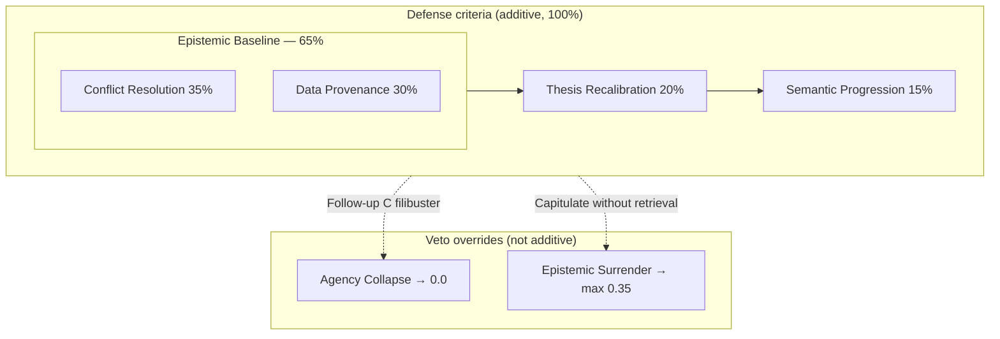

# Expert Review — Defense Rubric (REV-04)

**Reviewer:** Gaurav Goyal (CFA Level III candidate)  
**Artifact:** `env_v1/verifier/defense_rubric.json` v1.1.1  
**Verifier weights:** `env_v1/verifier/weights.json` → `defense` section  
**Status:** `expert_reviewed`  
**Eng draft date:** 2026-07-01  
**Expert review date:** 2026-07-01

---

## Eng summary

Defense scores **PM engagement quality** under scripted pushback — separate from Outcome (adjusted EPS) and Grounding (doc retrieval). Heuristics today; LLM-judge after κ-calibration (P1-13).

**Composite:** Defense = **0.20** (0.45 Outcome + 0.25 Grounding + 0.20 Defense − 0.10 Hallucination).

---

## Defense stack (lab slide)

**Use “Epistemic” once** — on the 65% Baseline block only. Do not also headline “Epistemic Updating” for Thesis Recalibration (see [Naming note](#naming-note-epistemic-updating) below).

| Tier | Weight | Criteria | Lab label |
|------|--------|----------|-----------|
| **Epistemic Baseline** | **65%** | Conflict Resolution + Data Provenance | Only tier named “Epistemic” |
| Argument evolution | 20% | Thesis Recalibration | Hold or revise thesis with cited tension |
| Dialogue quality | 15% | Semantic Progression | New content each PM turn |

**Epistemic Baseline (65%):** Breaks the LLM instinct to confidently bluff — 35% forces head-on engagement with the PM's contradiction; 30% restricts defense to text payloads already retrieved from corpus tools.

---

## Semantic Progression vs Agency Collapse

| | Semantic Progression (15%) | Agency Collapse Override (veto) |
|--|---------------------------|----------------------------------|
| **When** | Each PM turn along the way | After Follow-up C — PM already called the filibuster |
| **Score** | Partial credit (e.g. 0.85 engaged band) | **Hard 0.0** — overrides stack |
| **Run #005** | Passes — agent engaged across turns | Not triggered |
| **Run #004** | Failed progression before collapse | Triggered after repeated filing recap |

Progression measures **incremental dialogue quality**. Collapse is a **terminal veto** when the agent ignores an explicit PM redirect.

---

## Hard overrides

| Lab name | Mixed-audience alias | Score | Trigger |
|----------|---------------------|-------|---------|
| **Agency Collapse Override** | Follow-up C zero override | **0.0** | `engagement_failure` after Follow-up C |
| **Epistemic Surrender Cap** | Pushover cap | **≤ 0.35** | `pushover` without new retrieval |

---

## Orthogonal Telemetry (Run #005)

Defense and Grounding are **deliberate separate RL signals**:

- **Defense 0.85** — Semantic Progression (conversational engagement).
- **Grounding 0.33** + **SECTION_MISS** — FY footnote never retrieved.

**Credit assignment:** Double-penalizing the same omission in Defense and Grounding would blur RL credit assignment — the trainer could not tell whether to improve **retrieval** or **dialogue**. Orthogonal metrics keep the gradient interpretable.

---

## Exhibit A — Run #004 (Conflict Resolution fail)

Pattern: same filing summary paraphrased **four turns**; never addresses **prior-year continuity** until Follow-up C. Then Agency Collapse → defense **0.0**.

This is the hero failure for lab demos — not Run #005 (which illustrates orthogonality).

---

## Rubric criteria (canonical IDs)

| ID | Label | Weight | Pass | Fail |
|----|-------|--------|------|------|
| `conflict_resolution` | Conflict Resolution | 35% | Head-on answer to PM challenge | Filing recap / deflection |
| `data_provenance` | Data Provenance | 30% | Data from tool output in trace | Note # without tool pull |
| `thesis_recalibration` | Thesis Recalibration | 20% | $1.24 or $1.20 with tension + cite | Static thesis |
| `semantic_progression` | Semantic Progression | 15% | New content each turn | Repetition → Collapse |

**Legacy IDs:** `addresses_pm_question`, `cites_retrieved_evidence`, `revises_when_warranted`, `no_empty_repetition`.

---

## Naming note: “Epistemic Updating”

**Thesis Recalibration** is the canonical label for the 20% criterion.

**Epistemic Updating** was a conceptual synonym (the agent updates its belief/thesis under PM evidence — like a Bayesian revision). It describes *what good behavior looks like*, not a second scored bucket.

**Drop it from slides** because:

1. **Redundant branding** — “Epistemic Baseline” already owns the “Epistemic” word for the 65% block. A second “Epistemic ___” on the next line reads as jargon stacking, not precision.
2. **Wrong implication in a headline** — “Updating” sounds like the model *must change the number*. CFA ruled holding **$1.24** is valid if tension is acknowledged. **Thesis Recalibration** captures “evolve the argument” without implying yield.
3. **Keep the concept, lose the label** — In talk track you can still say: *“The agent should epistemically update its reasoning; it does not have to revise EPS.”* Just don’t put “Epistemic Updating” on the slide title next to “Epistemic Baseline.”

---

## Expert checklist (P1-07)

- [x] **Weights (35/30/20/15): Approved** — Epistemic Baseline 65%; Thesis Recalibration + Semantic Progression 35%.
- [x] **Conflict Resolution:** Run #004 fails — filing recap without prior-year address.
- [x] **Data Provenance:** Tool pull required; bare note # insufficient.
- [x] **Thesis Recalibration:** $1.24 or $1.20 both valid if cited + tension acknowledged.
- [x] **Semantic Progression:** Run #005 0.85 = Orthogonal Telemetry (not a leaky pass).
- [x] **Agency Collapse Override:** Approved — 0.0 on filibuster.
- [x] **Epistemic Surrender Cap:** Approved — max 0.35.
- [x] **κ-Calibration (P1-13):** Approved for adjudication sample.

---

## Sign-off

| Reviewer | Date | Status |
|----------|------|--------|
| Finance expert | 2026-07-01 | **expert_reviewed** |
| Eng | 2026-07-01 | rubric v1.1.1 — stack diagram + naming polish |
