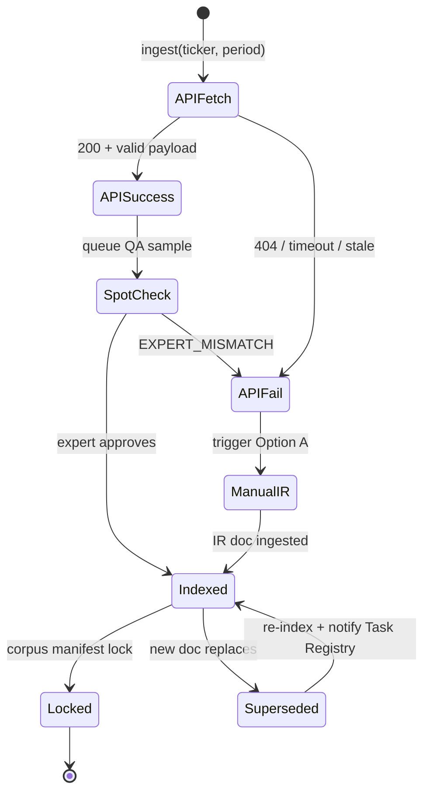

# Corpus Service — Component Spec

**Version:** 0.1 (draft)  
**Status:** Design — no implementation  
**Owner:** Platform Engineering  
**Consumers:** Task Registry, Tool Sandbox (`Search_Filing`, `PDF_Parser`), Scoring Engine (Layer 3 citations)

---

## 1. Purpose

The Corpus Service is the **single source of truth** for all benchmark documents: SEC filings, earnings transcripts, and reference data (FX rates). It provides:

- Ingestion from **primary (Transcript API)** and **fallback (Manual IR)** paths
- Normalized document records with **provenance metadata**
- Section- and table-level indexing for agent tool retrieval
- Checksum-locked corpus snapshots tied to benchmark releases

---

## 2. Scope

### In scope (MVD — benchmark v0.1)

| Asset | Count | Source |
|-------|-------|--------|
| 10-K | 15 companies × 2 FY (2023, 2024) | SEC EDGAR |
| 10-Q | 15 companies × ~6 quarters (2024–2025) | SEC EDGAR |
| Earnings transcripts | 15 companies × ~6 quarters | Transcript API (primary) + Manual IR (fallback) |
| FX reference rates | Pairs relevant to cross-border tasks | FRED / Treasury |
| Ticker → CIK registry | 15 tickers | SEC EDGAR |

### Out of scope (v0.2+)

- FactSet / Bloomberg integration
- Real-time post-earnings ingest
- Peer/comp set data beyond filing corpus

---

## 3. Architecture Overview

```
┌─────────────────────────────────────────────────────────────────┐
│                        Corpus Service                            │
├─────────────────────────────────────────────────────────────────┤
│  Ingestion Layer                                                 │
│    ├── EDGAR Fetcher          (10-K, 10-Q)                    │
│    ├── Transcript API Client  (Option B — primary)              │
│    ├── Manual IR Importer     (Option A — fallback)             │
│    └── FX Rate Loader         (FRED)                          │
├─────────────────────────────────────────────────────────────────┤
│  Processing Layer                                                │
│    ├── Normalizer             (unified doc schema)              │
│    ├── Section Indexer        (10-K/10-Q structure)             │
│    ├── Transcript Segmenter   (speaker blocks, Q&A)             │
│    └── Table Extractor        (table_id, headers, cells)        │
├─────────────────────────────────────────────────────────────────┤
│  Storage Layer                                                   │
│    ├── Object Storage         (raw + normalized text)             │
│    └── Corpus DB              (metadata, indexes, checksums)      │
├─────────────────────────────────────────────────────────────────┤
│  API Layer                                                       │
│    ├── Document CRUD / lookup                                   │
│    ├── Section search                                           │
│    └── Corpus manifest (version lock)                           │
└─────────────────────────────────────────────────────────────────┘
         │                    │                    │
         ▼                    ▼                    ▼
   Task Registry        Tool Sandbox          Scoring Engine
```

---

## 4. Document Record Schema

Every document in the corpus conforms to this schema regardless of acquisition path.

```json
{
  "doc_id": "{TICKER}_{doc_type}_{fiscal_period}",
  "ticker": "NFLX",
  "cik": "0001065280",
  "doc_type": "earnings_transcript | 10-K | 10-Q | fx_reference",
  "fiscal_period": "2024Q2",
  "event_date": "2024-07-18",
  "filing_date": null,
  "form_type": null,

  "acquisition_method": "edgar | api | manual_ir | fred",
  "source_tier": "primary | primary_official | secondary",
  "source_vendor": "finnhub | sec_edgar | fred | null",
  "source_url": "https://...",

  "fallback_reason": null,
  "supersedes": null,
  "superseded_by": null,
  "comment": "Option A fallback — API had no coverage for WBD 2024Q2",

  "checksum": "sha256:abc123...",
  "raw_ref": "corpus/raw/NFLX_transcript_2024Q2.pdf",
  "text_ref": "corpus/text/NFLX_transcript_2024Q2.txt",
  "indexed_at": "2025-06-25T12:00:00Z",
  "index_version": "1.0.0"
}
```

### Field rules

| Field | Required | Notes |
|-------|----------|-------|
| `doc_id` | Yes | Immutable once published; format enforced |
| `acquisition_method` | Yes | `api` for Option B; `manual_ir` for Option A |
| `source_tier` | Yes | `primary_official` when ingested via IR fallback |
| `fallback_reason` | If fallback | Enum: `API_404`, `API_STALE`, `EXPERT_MISMATCH`, `COVERAGE_GAP`, `CITATION_DISPUTE` |
| `supersedes` | If replacing | Points to prior `doc_id` |
| `checksum` | Yes | Computed on normalized text, not raw binary |

---

## 5. Section Index Schema

Filings and transcripts are indexed for tool retrieval.

```json
{
  "section_id": "NFLX_10K_2024_note_15",
  "doc_id": "NFLX_10K_2024",
  "section_type": "income_statement | cash_flow | balance_sheet | note | mdna | segment_table | transcript_remarks | transcript_qa",
  "section_name": "Note 15 — Segment Information",
  "page_start": 85,
  "page_end": 89,
  "chunk_ids": ["chunk_001", "chunk_002"],
  "table_ids": ["seg_rev_001"],
  "parent_section_id": null
}
```

### Transcript segments (additional)

```json
{
  "segment_id": "NFLX_transcript_2024Q2_seg_012",
  "doc_id": "NFLX_transcript_2024Q2",
  "speaker": "Ted Sarandos",
  "speaker_role": "Co-CEO",
  "segment_type": "prepared_remarks | qa_response",
  "char_start": 12400,
  "char_end": 14200,
  "text_preview": "We expect content amortization to..."
}
```

---

## 6. Transcript Ingestion — Dual Source Policy

### Primary: Option B — Transcript API

```
# Ingestion config comment (for future implementation):
# primary: transcript_api
# vendor: TBD (Finnhub / API Ninjas — selected Week 1)
# See fallback policy in §6.2 and runbook §3
```

**Flow:**

1. Resolve ticker → API symbol
2. Fetch transcript for `{ticker, fiscal_period, event_date}`
3. Normalize to unified schema (`acquisition_method: "api"`)
4. Segment by speaker / Q&A
5. Compute checksum, store raw + text
6. Queue for expert spot-check (10% sample)

### Fallback: Option A — Manual IR

```
# Fallback: manual_ir
# Trigger when API fails or expert rejects API text.
# Official IR transcript is citation authority on conflict.
# Procedure: see §6.2 and runbook below.
```

**Runbook (Option A — Manual IR Transcript Ingest):**

1. Navigate to `{company}` IR → Events & Presentations
2. Locate earnings call for `{fiscal_period}`
3. Download official PDF/HTML transcript (prefer issuer PDF)
4. Normalize to `corpus/text/{TICKER}_{period}.txt`
5. Set metadata:
   - `acquisition_method: "manual_ir"`
   - `source_tier: "primary_official"`
   - `source_url: {IR page URL}`
   - `fallback_reason: {trigger enum}`
6. Re-run checksum + re-index speaker segments
7. If replacing API doc: set `superseded_by` on old record; link `supersedes` on new
8. Expert re-validates guidance quotes for affected Guidance Drift tasks

---

## 7. Fallback State Machine



### Transition rules

| From | Event | To | Side effect |
|------|-------|-----|-------------|
| `APIFetch` | Success | `SpotCheck` | Write provisional doc record |
| `SpotCheck` | Approve | `Indexed` | `source_tier: primary` |
| `SpotCheck` | Reject | `APIFail` | Log `EXPERT_MISMATCH` |
| `APIFail` | Any trigger | `ManualIR` | Alert Data Ops |
| `ManualIR` | Success | `Indexed` | `source_tier: primary_official` |
| `Indexed` | Manifest lock | `Locked` | Checksum frozen |
| `Indexed` | Replacement | `Superseded` | Old doc `superseded_by` set; Task Registry notified |

### Citation authority on conflict

When both API and IR versions exist for the same `{ticker, fiscal_period}`:

1. **IR official (`primary_official`) wins** for ground truth citations
2. API version marked `superseded_by: {ir_doc_id}`
3. Affected Guidance Drift tasks flagged for expert re-validation

---

## 8. API Contract (Corpus Service)

Base path: `/api/v1/corpus`

### 8.1 Documents

#### `GET /documents/{doc_id}`

Returns full document record + text reference.

**Response 200:**
```json
{
  "doc": { /* Document Record */ },
  "sections": [ /* Section Index[] */ ],
  "text_url": "/api/v1/corpus/documents/{doc_id}/text"
}
```

#### `GET /documents/{doc_id}/text`

Returns normalized plain text.

#### `GET /documents`

Query params: `ticker`, `doc_type`, `fiscal_period`, `acquisition_method`

**Response 200:** `{ "documents": [ /* Document Record[] */ ], "total": 12 }`

---

### 8.2 Search

#### `POST /search/sections`

Used by `Search_Filing` tool.

**Request:**
```json
{
  "ticker": "GOOGL",
  "query": "capitalized software development costs",
  "doc_types": ["10-K", "10-Q"],
  "fiscal_periods": ["2024", "2023"],
  "section_types": ["note", "cash_flow"],
  "limit": 10
}
```

**Response 200:**
```json
{
  "results": [
    {
      "section_id": "GOOGL_10K_2024_note_2",
      "doc_id": "GOOGL_10K_2024",
      "section_name": "Note 2 — Significant Accounting Policies",
      "relevance_score": 0.92,
      "snippet": "...capitalized software development costs are amortized...",
      "page_start": 62
    }
  ]
}
```

#### `POST /search/transcript-segments`

Used by Guidance Drift tasks.

**Request:**
```json
{
  "ticker": "NFLX",
  "fiscal_period": "2024Q2",
  "query": "content amortization guidance",
  "segment_types": ["prepared_remarks", "qa_response"],
  "limit": 5
}
```

---

### 8.3 Tables

#### `GET /documents/{doc_id}/tables/{table_id}`

Returns structured table extracted from filing.

**Response 200:**
```json
{
  "table_id": "seg_rev_001",
  "doc_id": "GOOGL_10K_2024",
  "caption": "Revenue by segment",
  "headers": ["Segment", "2024", "2023"],
  "rows": [
    ["Google Services", "307394", "272543"],
    ["Google Cloud", "43224", "33088"]
  ],
  "unit": "USD_millions",
  "page": 87
}
```

---

### 8.4 FX Reference

#### `GET /fx-rates`

Query params: `pair` (e.g. `EURUSD`), `period` (e.g. `2024Q2`)

**Response 200:**
```json
{
  "pair": "EURUSD",
  "period": "2024Q2",
  "rate_type": "weighted_average",
  "rate": 1.0812,
  "source": "fred",
  "source_series_id": "DEXUSEU"
}
```

---

### 8.5 Corpus Manifest

#### `GET /manifest/{version}`

Returns locked corpus snapshot for benchmark release.

**Response 200:**
```json
{
  "corpus_version": "corpus_v1",
  "benchmark_version": "benchmark_v0.1",
  "locked_at": "2025-08-01T00:00:00Z",
  "tickers": ["GOOGL", "AMZN", "..."],
  "document_count": 210,
  "checksum_root": "sha256:...",
  "documents": [
    { "doc_id": "...", "checksum": "..." }
  ],
  "acquisition_summary": {
    "edgar": 120,
    "api": 75,
    "manual_ir": 15,
    "fred": 1
  }
}
```

#### `POST /manifest/{version}/lock`

**Auth:** Admin only. Freezes corpus; rejects further ingest for locked tickers/periods.

---

### 8.6 Ingestion (internal / admin)

#### `POST /ingest/edgar`

**Request:** `{ "tickers": ["GOOGL"], "form_types": ["10-K"], "periods": ["2024"] }`

#### `POST /ingest/transcript-api`

**Request:** `{ "tickers": ["NFLX"], "periods": ["2024Q2"] }`  
**Behavior:** Primary path (Option B). On failure → enqueue fallback job.

#### `POST /ingest/transcript-manual`

**Request:** `{ "ticker": "WBD", "fiscal_period": "2024Q2", "source_url": "...", "file_ref": "..." }`  
**Behavior:** Fallback path (Option A). Requires `fallback_reason`.

---

## 9. 15-Company Registry (MVD)

| Sector | Ticker | CIK (to verify) |
|--------|--------|-----------------|
| Tech | GOOGL | 0001652044 |
| Tech | AMZN | 0001018724 |
| Tech | META | 0001326801 |
| Tech | MSFT | 0000789019 |
| Tech | AAPL | 0000320193 |
| Media | NFLX | 0001065280 |
| Media | DIS | 0001744489 |
| Media | WBD | 0001437107 |
| Media | CMCSA | 0001166691 |
| Media | SPOT | 0001639920 |
| Consumer | PEP | 0000077476 |
| Consumer | MCD | 0000063908 |
| Consumer | KO | 0000021344 |
| Consumer | SBUX | 0000829224 |
| Consumer | MDLZ | 0001103982 |

---

## 10. Acceptance Criteria

### AC-1: EDGAR ingestion

- [ ] All 15 tickers mapped to CIK with validation against SEC
- [ ] 10-K (FY2023, FY2024) and 10-Q (2024–2025) downloaded for all 15
- [ ] Every filing has `doc_id`, `checksum`, `text_ref`
- [ ] Section index covers: Income Statement, Balance Sheet, Cash Flow, MD&A, all Notes, Segment tables

### AC-2: Transcript ingestion (Option B primary)

- [ ] Transcript API vendor selected and documented
- [ ] ≥80% of required transcripts (~90) ingested via API
- [ ] Each API transcript has `acquisition_method: "api"`, `source_vendor` set
- [ ] Speaker segmentation present for 100% of transcripts

### AC-3: Transcript fallback (Option A)

- [ ] Runbook documented (§6 + Option A procedure)
- [ ] All API failures produce `fallback_reason` enum
- [ ] Manual IR backfill completes 100% coverage (no missing quarter for any of 15 tickers)
- [ ] Supersession chain correct when IR replaces API (`supersedes` / `superseded_by`)

### AC-4: Expert spot-check

- [ ] 10% sample (min 9 transcripts) reviewed before GT authoring
- [ ] Mismatch triggers Option A and documents `EXPERT_MISMATCH`
- [ ] Sign-off recorded in corpus QA log

### AC-5: FX reference data

- [ ] Weighted-average FX rates loaded for pairs used in cross-border tasks
- [ ] Rates queryable by `{pair, period}` via API
- [ ] Source documented (FRED series IDs)

### AC-6: Table extraction

- [ ] Segment revenue tables indexed with `table_id` for all 15 latest 10-K
- [ ] Table API returns headers, rows, unit, page

### AC-7: Search API

- [ ] Section search returns relevant results for 5 expert-defined test queries
- [ ] Transcript segment search returns speaker-attributed snippets
- [ ] Latency p95 < 500ms for single-ticker search (local/staging)

### AC-8: Corpus manifest

- [ ] `corpus_v1` manifest generated with root checksum
- [ ] `acquisition_summary` reflects api vs manual_ir counts
- [ ] Lock prevents mutation of locked documents
- [ ] Task Registry can resolve `doc_id` → checksum from manifest

### AC-9: Provenance & audit

- [ ] 100% of documents have non-null `source_url`
- [ ] Every fallback document has `comment` explaining Option A use
- [ ] Citation authority rule enforced: IR wins on conflict

### AC-10: Integration

- [ ] `Search_Filing` tool consumes `/search/sections` successfully
- [ ] `PDF_Parser` tool consumes `/documents/{id}/text` and `/tables/{id}`
- [ ] Scoring Engine resolves Layer 3 citation `doc_id` + page/snippet against corpus

---

## 11. Non-Functional Requirements

| Requirement | Target |
|-------------|--------|
| Availability (staging) | 99% during eval campaigns |
| Corpus lock immutability | Locked docs cannot be overwritten |
| Idempotent ingest | Re-run same ingest → same `doc_id`, no duplicates |
| Storage | Raw + text retained for full benchmark lifecycle |
| Security | No PII; public filings only; API keys in env/secrets |

---

## 12. Dependencies

| Dependency | Owner | Needed by |
|------------|-------|-----------|
| SEC EDGAR access | Data Ops | Week 1 |
| Transcript API account | Data Ops | Week 1 |
| FRED API | Platform Eng | Week 3 |
| Expert spot-check capacity | Domain Expert | Week 3 |
| Section indexer (PDF/HTML parser) | Platform Eng | Week 2–4 |

---

## 13. Risks

| Risk | Mitigation |
|------|------------|
| API missing WBD/SPOT transcripts | Option A runbook; budget 10–15 hrs manual |
| 10-K PDF layout breaks table extraction | Manual table tagging for pilot; parser version in manifest |
| IR vs API text drift | Citation authority rule; supersession workflow |
| EDGAR rate limits | Throttled fetcher; cache locally |

---

## 14. Timeline (Corpus Track)

| Week | Milestone |
|------|-----------|
| 1 | CIK registry; EDGAR fetch starts; API vendor trial |
| 2 | EDGAR complete; API bulk transcript pull; coverage report |
| 3 | Manual IR backfill for gaps; section indexing; FX load |
| 4 | Expert spot-check; table extraction QA; manifest v1 lock |

---

## 15. Open Items

- [ ] Transcript API vendor final selection (Week 1)
- [ ] Confirm FRED series IDs for EUR, JPY, GBP weighted averages
- [ ] Decide object storage backend (S3 / GCS / local for dev)

---

*Next spec: Task Registry → `docs/specs/task-registry.md`*
