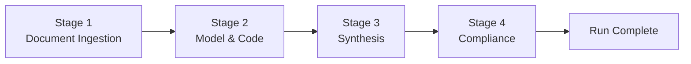
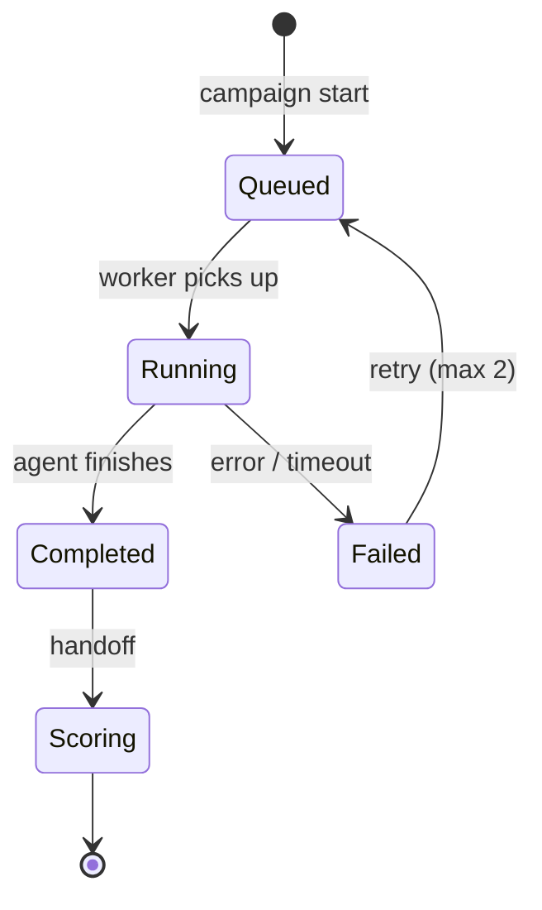

> **Note (v0.2):** MVD pilot is **15 tasks** (5 companies). Sections referencing 45 tasks describe **v0.1b scale** — see [Roadmap](../ROADMAP.md).

# Eval Orchestrator — Component Spec

**Version:** 0.1 (draft)  
**Status:** Design — no implementation  
**Owner:** Platform Engineering  
**Consumers:** Model adapters, Trajectory Logger, Scoring Engine, Task Registry

---

## 1. Purpose

The Eval Orchestrator runs **model-agnostic benchmark campaigns**: it loads tasks from the Task Registry, invokes agents through standardized adapters, enforces the 4-stage workflow, captures full trajectories, and delivers run artifacts to the Scoring Engine.

**MVD eval policy:** **3 runs per task per model** (variance study; median aggregation).

---

## 2. Design Principles

| Principle | Implementation |
|-----------|----------------|
| Model-agnostic | Adapter layer — any tool-using LLM agent |
| Reproducible | Fixed corpus snapshot, run config, seed where supported |
| Observable | Full trajectory logged per step |
| Bounded | Tool call limits, token budgets, timeouts per task |
| Stage-aware | 4-stage workflow tracked and evaluable independently |

---

## 3. Architecture

```
┌─────────────────────────────────────────────────────────────────┐
│                      Eval Orchestrator                           │
├─────────────────────────────────────────────────────────────────┤
│  Campaign Manager                                                │
│    ├── Campaign config (tasks × models × runs)                  │
│    ├── Job queue + retry policy                                 │
│    └── Progress / status API                                    │
├─────────────────────────────────────────────────────────────────┤
│  Agent Runtime                                                   │
│    ├── Orchestrator loop (plan → tool → observe)                │
│    ├── Stage tracker (1–4)                                      │
│    ├── Context manager (anti-bloat)                             │
│    └── Termination handler (complete / max_steps / error)       │
├─────────────────────────────────────────────────────────────────┤
│  Model Adapter Layer                                             │
│    ├── Adapter: OpenAI-compatible                               │
│    ├── Adapter: Anthropic-compatible                            │
│    ├── Adapter: Open-source / local                             │
│    └── Adapter: Custom internal                                 │
├─────────────────────────────────────────────────────────────────┤
│  Tool Sandbox                                                    │
│    ├── Search_Filing      → Corpus Service                      │
│    ├── PDF_Parser         → Corpus Service                      │
│    ├── Python_Interpreter → isolated container                │
│    ├── Vector_Search      → Corpus + future peer corpus         │
│    ├── Knowledge_Graph_Query                                    │
│    └── Compliance_Linter  → Scoring Engine rules (read-only)  │
├─────────────────────────────────────────────────────────────────┤
│  Trajectory Logger                                               │
│    └── Append-only step stream → object storage                 │
└─────────────────────────────────────────────────────────────────┘
         │                              │
         ▼                              ▼
   Task Registry                  Scoring Engine
```

---

## 4. Model Adapter Contract

Any agent integrates by implementing:

```typescript
// Conceptual interface — not implemented code
interface ModelAdapter {
  model_id: string;
  adapter_version: string;

  run(taskSpec: AgentTaskSpec, config: RunConfig, callbacks: TrajectoryCallbacks): Promise<AgentRunResult>;
}

interface RunConfig {
  run_index: 1 | 2 | 3;
  seed?: number;
  temperature: number;
  max_tokens: number;
  max_tool_calls: number;
  timeout_seconds: number;
}

interface TrajectoryCallbacks {
  onThought(step: ThoughtStep): void;
  onToolCall(step: ToolCallStep): void;
  onToolResult(step: ToolResultStep): void;
  onStageTransition(from: Stage, to: Stage): void;
  onFinalOutput(output: StructuredOutput): void;
}
```

### Minimum agent capabilities

| Capability | Required |
|------------|----------|
| Tool / function calling | Yes |
| Step-level callbacks or streaming | Yes |
| Structured final output | Yes |
| Configurable temperature / budget | Yes |

### Model tiers (registry categories)

| Tier | Purpose |
|------|---------|
| **Tier A — Frontier** | Primary benchmark targets |
| **Tier B — Mid-tier** | Capability discrimination |
| **Tier C — Ablations** | No-tools / no-code / no-compliance variants |

No vendor lock-in — `model_id` + `adapter_version` + `run_config` documented per campaign.

---

## 5. Four-Stage Workflow Enforcement



| Stage | Expected tools / behavior | Tracked signals |
|-------|--------------------------|-----------------|
| 1 — Ingestion | `Search_Filing`, `PDF_Parser` | Sections accessed, bloat ratio |
| 2 — Modeling | `Python_Interpreter` | Script hash, accounting identity check |
| 3 — Synthesis | `Vector_Search`, CoT | Assumption justification, peer refs |
| 4 — Compliance | `Compliance_Linter` | Violations, uncertainty flags |

**Soft enforcement (MVD):** Stages logged and scored independently; agent not hard-blocked mid-run.  
**Hard enforcement (v0.2 option):** Stage 4 linter pass required before submission accepted.

---

## 6. Trajectory Record Schema

```json
{
  "run_id": "run_abc123",
  "campaign_id": "campaign_001",
  "task_id": "GOOGL_footnote_reconciliation",
  "model_id": "tier_a_model_x",
  "adapter_version": "openai_compat_v1",
  "run_index": 2,
  "run_config": {
    "temperature": 0,
    "seed": 42,
    "max_tool_calls": 40,
    "corpus_version": "corpus_v1"
  },

  "started_at": "2025-08-15T10:00:00Z",
  "completed_at": "2025-08-15T10:12:34Z",
  "termination_reason": "completed | max_tool_calls | timeout | error",

  "stages": [
    {
      "stage": 1,
      "started_at": "...",
      "completed_at": "...",
      "steps": [
        {
          "step_id": "step_001",
          "timestamp": "...",
          "thought": "Need segment table and Note 2 accounting policies...",
          "tool": "Search_Filing",
          "tool_input": { "ticker": "GOOGL", "query": "..." },
          "tool_output_summary": "3 sections returned",
          "tool_output_ref": "artifacts/run_abc123/step_001.json",
          "sections_accessed": ["GOOGL_10K_2024_note_15"],
          "tokens_in": 800,
          "tokens_out": 1200,
          "latency_ms": 450
        }
      ]
    }
  ],

  "final_output": {
    "schema_version": "investment_memo_v1",
    "output_ref": "artifacts/run_abc123/final_output.json"
  },

  "metrics": {
    "total_tool_calls": 12,
    "total_tokens": 45000,
    "sections_unique": 4,
    "context_bloat_score": 0.15,
    "python_executions": 2,
    "compliance_lint_runs": 1
  },

  "fracture_codes": []
}
```

---

## 7. Fracture Detection (Runtime)

| Code | Trigger | Stage |
|------|---------|-------|
| `LOOP_TOOL` | Same tool+input ≥3 times | Any |
| `BLOAT_CTX` | >50% doc loaded vs minimal section set | 1 |
| `NO_CODE` | Stage 2 complete without Python call | 2 |
| `SIGN_ERR` | Detected in post-run Layer 1 | 2 |
| `HALLUC_FILL` | Output claims without tool-sourced data | 3 |
| `CITE_BROAD` | Citation without doc_id+page | 3 |
| `COMPLIANCE_FAIL` | Linter violations unresolved | 4 |
| `MAX_STEPS` | Hit tool call limit | Any |
| `TIMEOUT` | Exceeded task timeout | Any |

Fracture codes attached to trajectory at run end; union across 3 runs for reporting (tag if ≥2/3 runs).

---

## 8. Campaign Configuration

```json
{
  "campaign_id": "campaign_001",
  "benchmark_version": "benchmark_v0.1",
  "corpus_version": "corpus_v1",
  "description": "MVD initial eval — 45 tasks, Tier A/B models",

  "tasks": {
    "source": "benchmark_v0.1",
    "filter": null,
    "count": 45
  },

  "models": [
    {
      "model_id": "tier_a_frontier_1",
      "adapter": "openai_compat_v1",
      "tier": "A",
      "run_config": { "temperature": 0, "max_tool_calls": 40 }
    },
    {
      "model_id": "tier_b_mid_1",
      "adapter": "anthropic_compat_v1",
      "tier": "B",
      "run_config": { "temperature": 0, "max_tool_calls": 40 }
    }
  ],

  "runs_per_task": 3,
  "aggregation": {
    "score": "median",
    "layer3_compliance": "worst_run_wins",
    "fracture": "union_2_of_3"
  },

  "parallelism": {
    "max_concurrent_runs": 10
  }
}
```

### Execution volume (MVD planning)

```
Total runs = 45 tasks × N models × 3 runs

Examples:
  3 Tier A models  → 405 runs
  5 models total   → 675 runs
```

---

## 9. Tool Sandbox Specifications

| Tool | Input | Output | Sandbox rules |
|------|-------|--------|---------------|
| `Search_Filing` | ticker, query, filters | Ranked sections | Read-only corpus |
| `PDF_Parser` | doc_id, section/table | Text/table JSON | Read-only corpus |
| `Python_Interpreter` | script, data refs | stdout, artifacts | No network; timeout 60s; memory cap |
| `Vector_Search` | query, corpus filter | Ranked chunks | Read-only |
| `Knowledge_Graph_Query` | entity, relation | Graph nodes | Read-only (v0.1 optional) |
| `Compliance_Linter` | memo draft, mandate | violations[] | Read-only rules |

---

## 10. API Contract

Base path: `/api/v1/eval`

| Method | Path | Description |
|--------|------|-------------|
| `POST` | `/campaigns` | Create campaign from config |
| `GET` | `/campaigns/{id}` | Campaign status + progress |
| `POST` | `/campaigns/{id}/start` | Begin execution |
| `POST` | `/campaigns/{id}/pause` | Pause queue |
| `GET` | `/campaigns/{id}/runs` | List runs; filter task, model, status |
| `GET` | `/runs/{run_id}` | Full trajectory + output refs |
| `GET` | `/runs/{run_id}/trajectory` | Step stream |
| `POST` | `/runs/{run_id}/retry` | Retry failed run |
| `GET` | `/campaigns/{id}/leaderboard` | Aggregated scores (post-scoring) |

### Dry-run endpoint

`POST /campaigns/dry-run` — Execute 5 tasks × 1 model for integration validation.

---

## 11. Run Lifecycle



---

## 12. Acceptance Criteria

### AC-1: Model-agnostic execution
- [ ] ≥2 distinct adapters run same task successfully
- [ ] Adapter contract documented and versioned

### AC-2: Trajectory completeness
- [ ] 100% completed runs have full step stream (thought + tool I/O)
- [ ] Stage boundaries recorded for all 4 stages

### AC-3: Three-run policy
- [ ] Campaign executes exactly 3 runs per task × model
- [ ] Runs use identical config except `run_index` / seed

### AC-4: Tool sandbox
- [ ] All 5 core tools operational (KG optional)
- [ ] Python sandbox: no network egress verified
- [ ] Tool outputs stored and referenced in trajectory

### AC-5: Fracture detection
- [ ] All 9 fracture codes detectable in test scenarios
- [ ] Codes attached to trajectory record

### AC-6: Campaign scale
- [ ] Successfully completes dry-run (5 tasks × 1 model × 3 runs)
- [ ] Successfully completes full MVD campaign (45 × N × 3) without data loss

### AC-7: Integration
- [ ] Loads agent-spec from Task Registry
- [ ] Hands completed runs to Scoring Engine automatically
- [ ] Respects corpus manifest lock (no stale doc access)

### AC-8: Reproducibility
- [ ] Run record includes corpus_version, benchmark_version, run_config
- [ ] Re-run with same seed produces comparable trajectory (where model supports)

---

## 13. Non-Functional Requirements

| Requirement | Target |
|-------------|--------|
| Run artifact retention | Full trajectory + outputs for benchmark lifecycle |
| Retry policy | Max 2 retries on transient failure |
| Concurrent runs | Configurable; default 10 |
| Cost tracking | Token + tool call totals per run and campaign |

---

## 14. Timeline

| Week | Milestone |
|------|-----------|
| 5–7 | Tool sandbox v1 (4 core tools) |
| 6–8 | Trajectory logger + adapter layer v1 |
| 7–9 | Single-model end-to-end on 3 pilot tasks |
| 11 | Dry-run campaign (5 tasks) |
| 12–13 | Full MVD campaign |

---

*See also: `docs/ZSTATE_EQUITY_RESEARCH_BENCHMARK_FRAMEWORK.md`*
