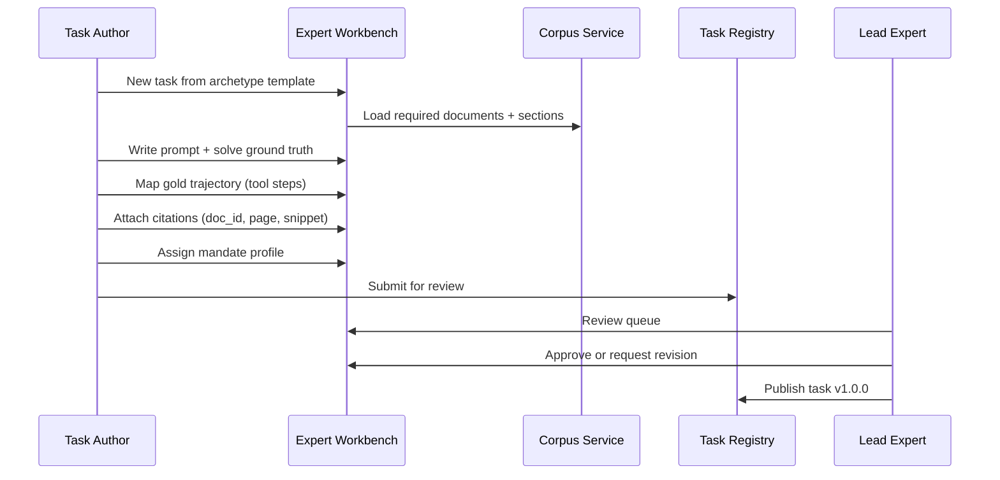

> **Note (v0.2):** MVD pilot is **15 tasks**. Throughput targets for 45 tasks apply to **v0.1b** — see [Roadmap](../ROADMAP.md).

# Expert Workbench — Component Spec

**Version:** 0.1 (draft)  
**Status:** Design — no implementation  
**Owner:** Domain Experts (CFA/MBA) + Task Engineering  
**Consumers:** Task Registry, Scoring Engine (Layer 2), Corpus Service (QA)

---

## 1. Purpose

The Expert Workbench is the **credentialed domain expert interface** for the equity research benchmark. It is where Zstate's human-in-the-loop advantage is operationalized:

- Author tasks, ground truth, and gold trajectories
- Review and publish tasks to the Task Registry
- Spot-check corpus quality (transcript API vs IR fallback)
- Score Layer 2 rubrics (assisted by trajectory analysis)
- Calibrate rubric anchors and inter-rater reliability

**Expert capacity plan:** 20–30 hrs/week (1 Lead CFA + 1 Associate + shared Compliance).

---

## 2. User Roles

| Role | Permissions | Typical hours/week |
|------|-------------|-------------------|
| **Lead Domain Expert (CFA)** | Approve/publish tasks; define rubric anchors; final Layer 2 sign-off | 10–12 |
| **Task Author (MBA/Associate)** | Draft tasks, ground truth, gold trajectories; first-pass Layer 2 | 12–15 |
| **Compliance Specialist** | FINRA/mandate rule editing; Layer 3 spot-check | 3–5 |
| **Platform Admin** | User management, read-only audit | — |

---

## 3. Architecture

```
┌─────────────────────────────────────────────────────────────────┐
│                      Expert Workbench (UI)                       │
├─────────────────────────────────────────────────────────────────┤
│  Task Authoring Module                                           │
│    ├── Archetype template wizard                                 │
│    ├── Prompt + constraint editor                                │
│    ├── Ground truth builder (values + citations)                 │
│    ├── Gold trajectory mapper (tool path + sections)             │
│    └── Layer 1 script attachment                                 │
├─────────────────────────────────────────────────────────────────┤
│  Review & Publish Module                                         │
│    ├── Review queue (Lead Expert)                                │
│    ├── Diff view (draft vs template)                             │
│    ├── Peer comment thread                                       │
│    └── Publish / request revision                                │
├─────────────────────────────────────────────────────────────────┤
│  Corpus QA Module                                                │
│    ├── Transcript spot-check queue (10% sample)                  │
│    ├── Side-by-side: API vs IR text                              │
│    ├── Trigger Option A fallback                                 │
│    └── Corpus sign-off                                           │
├─────────────────────────────────────────────────────────────────┤
│  Layer 2 Scoring Module                                          │
│    ├── Assisted scoring (pre-filled from trajectory diff)        │
│    ├── Rubric dimension cards (1–5 + evidence)                   │
│    ├── Anchor examples inline                                    │
│    └── Override with logged rationale                            │
├─────────────────────────────────────────────────────────────────┤
│  Calibration Module                                              │
│    ├── Inter-rater comparison                                    │
│    ├── Anchor example editor                                     │
│    └── κ statistics dashboard                                    │
└─────────────────────────────────────────────────────────────────┘
         │              │              │
         ▼              ▼              ▼
   Task Registry   Corpus Service   Scoring Engine
```

---

## 4. Task Authoring Workflow



### Archetype template wizard

Each archetype pre-loads:

| Field | Footnote | Guidance Drift | Cross-Border FX |
|-------|----------|----------------|-----------------|
| Default doc types | 10-K | Transcript + 10-Q | 10-K + FX table |
| Required output sections | reconciliation_table | guidance_vs_actuals_table | organic_growth_model |
| Layer 2 dimensions | footnote_utilization, contextual_awareness | contextual_awareness, forecast_bounding | forecast_bounding, footnote_utilization |
| Known failure modes | Pre-populated checklist | Pre-populated | Pre-populated |

---

## 5. Ground Truth Builder

### Citation picker UI

Expert selects from indexed corpus:

1. Search document sections (same API as agent `Search_Filing`)
2. Highlight text snippet → auto-capture `doc_id`, `page`, `char_range`, `snippet_hash`
3. For tables: pick `table_id` + cell reference
4. Validation: every `extracted_value` must have complete citation before submit

### Computed value attachment

1. Author writes Python verification script in workbench editor
2. Run against ground truth inputs (sandboxed)
3. Attach script ref to ground truth package
4. Layer 1 scorer uses same script at eval time

---

## 6. Gold Trajectory Mapper

Visual step builder aligned to 4 stages:

| UI Element | Function |
|------------|----------|
| Stage timeline | Drag steps into stages 1–4 |
| Tool picker | Select from allowed tools; fill input JSON |
| Section linker | Pick expected sections from corpus index |
| Rationale field | Required text per step (feeds Layer 2 anchors) |
| Anti-pattern tags | Document what agent should NOT do |
| Minimal section set | Auto-derived from linked sections |

**Output:** Gold trajectory JSON → Task Registry on publish.

---

## 7. Corpus QA Module

### Transcript spot-check queue

- System selects 10% of API-ingested transcripts (min 9 docs)
- Side-by-side view: API text vs IR official (if available)
- Expert actions:
  - **Approve** — mark verified
  - **Reject** — trigger Option A fallback with `EXPERT_MISMATCH`
  - **Flag task** — notify Task Author to re-validate guidance quotes

### Corpus sign-off

Lead Expert signs `corpus_v1` before task publishing begins at scale.

---

## 8. Layer 2 Assisted Scoring

### Pre-fill from trajectory analysis

When expert opens a run for scoring, workbench displays:

| Panel | Content |
|-------|---------|
| Trajectory diff | Gold vs agent section access (green/red) |
| Tool sequence diff | Ordered tool calls compared |
| CoT excerpts | Key reasoning paragraphs highlighted |
| Suggested scores | Per dimension, from automated analysis |
| Anchor examples | Score 1–5 reference cases inline |

Expert confirms or overrides each dimension; override requires rationale text.

### Rubric dimension card

```
┌─────────────────────────────────────────────────────┐
│ Contextual Awareness                    [? anchors] │
├─────────────────────────────────────────────────────┤
│ Suggested: 4/5                                      │
│ Evidence: Normalized stock comp in EBITDA calc;      │
│           flagged divestiture as non-recurring       │
├─────────────────────────────────────────────────────┤
│ Your score: ( ) 1  ( ) 2  ( ) 3  (•) 4  ( ) 5      │
│ Override rationale: [optional]                       │
└─────────────────────────────────────────────────────┘
```

### Scoring workload (MVD)

| Phase | Tasks | Method |
|-------|-------|--------|
| Pilot | 15 | 100% expert scored |
| Scale | 30 | 20% spot-check |
| Calibration | 10 | Dual-rater for κ |

---

## 9. Review & Publish Module

### Review queue (Lead Expert)

| Column | Description |
|--------|-------------|
| Task ID | e.g. `NFLX_guidance_drift` |
| Author | Associate name |
| Archetype | guidance_drift |
| Citation completeness | 100% / gaps flagged |
| L1 script | Attached / missing |
| Mandate | Profile assigned |
| Action | Approve / Revise / Reject |

### Publish gate checklist (automated + manual)

- [ ] All extracted values cited
- [ ] Gold trajectory has ≥1 step per stage
- [ ] Known failure modes ≥2 documented
- [ ] Required docs in locked corpus manifest
- [ ] Mandate profile assigned
- [ ] Lead Expert approval recorded

---

## 10. API Contract (Workbench Backend)

Base path: `/api/v1/workbench`

| Method | Path | Description |
|--------|------|-------------|
| `GET` | `/templates/{archetype}` | Archetype template |
| `POST` | `/tasks/draft` | Create draft from template |
| `PUT` | `/tasks/draft/{id}` | Save draft |
| `POST` | `/tasks/draft/{id}/ground-truth` | Save GT package |
| `POST` | `/tasks/draft/{id}/gold-trajectory` | Save gold trajectory |
| `POST` | `/tasks/draft/{id}/verify-script/run` | Test L1 script |
| `POST` | `/tasks/draft/{id}/submit` | Submit to review queue |
| `GET` | `/review-queue` | Lead Expert queue |
| `POST` | `/tasks/{id}/approve` | Approve + publish |
| `POST` | `/tasks/{id}/revise` | Return with comments |
| `GET` | `/corpus/spot-check-queue` | Transcript QA queue |
| `POST` | `/corpus/spot-check/{doc_id}` | Approve/reject/fallback |
| `GET` | `/scoring/runs/{run_id}/assisted` | Pre-filled Layer 2 scores |
| `POST` | `/scoring/runs/{run_id}/layer2` | Submit expert Layer 2 scores |
| `GET` | `/calibration/inter-rater` | κ dashboard |

---

## 11. Expert Weekly Cadence

| Day | Associate (12–15 hrs) | Lead CFA (10–12 hrs) |
|-----|----------------------|---------------------|
| Mon | Draft 1 task (prompt + GT) | Review prior batch |
| Tue | Gold trajectory + citations | Rubric anchor refinement |
| Wed | Draft 1 task | Review + approve |
| Thu | L1 scripts + submit | Archetype template updates |
| Fri | Layer 2 spot-check scoring | Corpus QA sign-off |

**Throughput:** 4–5 tasks/week → 45 tasks in 10–12 weeks.

---

## 12. Acceptance Criteria

### AC-1: Task authoring
- [ ] All 3 archetype templates operational
- [ ] Citation picker captures full provenance metadata
- [ ] Draft → publish workflow functional

### AC-2: Ground truth quality
- [ ] Workbench blocks submit if citation incomplete
- [ ] L1 verify script runnable from workbench sandbox

### AC-3: Review workflow
- [ ] Lead Expert queue with approve/revise/reject
- [ ] Publish gate checklist enforced

### AC-4: Corpus QA
- [ ] Spot-check queue generates 10% sample
- [ ] Reject triggers Option A fallback in Corpus Service

### AC-5: Layer 2 scoring
- [ ] Assisted pre-fill displays trajectory diff
- [ ] Expert override requires rationale
- [ ] Scores flow to Scoring Engine

### AC-6: Calibration
- [ ] Dual-rater mode for 10 tasks
- [ ] κ computed and displayed (target ≥ 0.7)

### AC-7: Throughput
- [ ] Pilot 3 tasks (GOOGL) completed through full workflow in Week 3–4
- [ ] 45 tasks published within 12-week plan

---

## 13. Dependencies

| Dependency | Required for |
|------------|--------------|
| Corpus Service (indexed) | Citation picker, QA module |
| Task Registry API | Publish workflow |
| Scoring Engine | Layer 2 assisted scoring |
| Archetype templates (content) | Week 2 deliverable from Lead Expert |

---

## 14. Timeline

| Week | Milestone |
|------|-----------|
| 2 | Archetype templates finalized |
| 3–4 | Pilot 3 tasks via workbench (GOOGL) |
| 4–12 | Batch authoring 45 tasks |
| 3 | Corpus spot-check module |
| 11–13 | Layer 2 scoring module live for eval campaign |

---

*See also: `docs/ZSTATE_EQUITY_RESEARCH_BENCHMARK_FRAMEWORK.md`*
