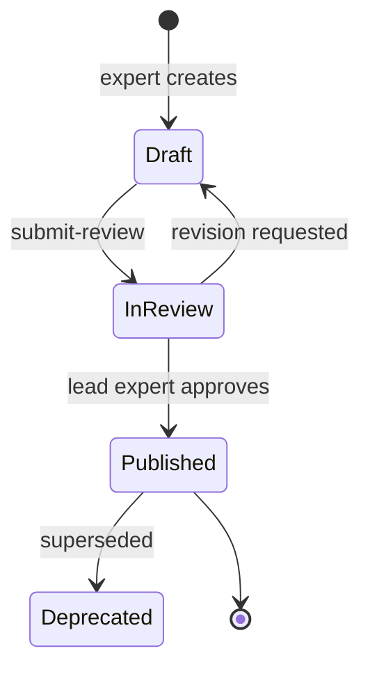

# Task Registry — Component Spec

**Version:** 0.1 (draft)  
**Status:** Design — no implementation  
**Owner:** Task Engineering + Domain Experts  
**Consumers:** Eval Orchestrator, Expert Workbench, Scoring Engine, Corpus Service

---

## 1. Purpose

The Task Registry is the **authoritative catalog of benchmark tasks** for the equity research benchmark. Each task bundles:

- A natural-language prompt (what the agent must solve)
- Required corpus documents (locked to checksums)
- Tool permissions and output schema
- Ground truth package (numeric answers, thesis anchors)
- Gold trajectory (expert-defined optimal tool path)
- Mandate profile attachment (client constraint overlay)

**MVD target (v0.2):** **15 tasks** = 5 companies × 3 archetypes. Scale to 45 at v0.1b per [Roadmap](../ROADMAP.md).

**Dual-control episodes (Track B):** See `env_v1/` — not stored in Task Registry; separate episode catalog.

---

## 2. Task Archetypes

| Archetype ID | Name | Primary Skill | Documents |
|--------------|------|---------------|-----------|
| `footnote_reconciliation` | Footnote Reconciliation | Table ↔ footnote cross-reference | 10-K segment table + accounting policy note |
| `guidance_drift` | Guidance Drift | Qualitative guidance vs quantitative actuals | Earnings transcript + subsequent 10-Qs |
| `cross_border_fx` | Cross-Border / FX Model | Constant-currency organic growth modeling | 10-K geographic segments + FX rates |

Each of the 15 pilot companies receives exactly one task per archetype.

---

## 3. Task Record Schema

```json
{
  "task_id": "GOOGL_footnote_reconciliation",
  "version": "1.0.0",
  "status": "draft | in_review | published | deprecated",
  "benchmark_version": "benchmark_v0.1",

  "ticker": "GOOGL",
  "sector": "tech",
  "archetype": "footnote_reconciliation",
  "difficulty_tier": "L2",

  "prompt": {
    "text": "Determine whether Google Cloud revenue in the segment breakdown reconciles with the reclassification described in Note 2 (Significant Accounting Policies) of Alphabet's FY2024 10-K. Identify any discrepancy and quantify its impact on reported Google Services revenue.",
    "constraints": [
      "Use only documents listed in required_documents",
      "All extracted values must include citations",
      "Flag any data you cannot verify — do not interpolate"
    ]
  },

  "required_documents": [
    { "doc_id": "GOOGL_10K_2024", "checksum": "sha256:...", "role": "primary" }
  ],

  "allowed_tools": [
    "Search_Filing",
    "PDF_Parser",
    "Python_Interpreter",
    "Vector_Search",
    "Compliance_Linter"
  ],

  "mandate_profile": "no_speculative_language",
  "compliance_baseline": "finra_v1",

  "expected_outputs": {
    "schema_ref": "investment_memo_v1",
    "required_sections": [
      "executive_summary",
      "quantitative_findings",
      "reconciliation_table",
      "investment_view",
      "risk_disclosures",
      "citations"
    ],
    "structured_fields": [
      "recommendation",
      "reconciled_values",
      "discrepancy_flag"
    ]
  },

  "execution_limits": {
    "max_tool_calls": 40,
    "max_tokens": 120000,
    "timeout_seconds": 900,
    "required_stages": [1, 2, 3, 4]
  },

  "ground_truth_ref": "ground_truth/GOOGL_footnote_reconciliation_gt.json",
  "gold_trajectory_ref": "gold_trajectories/GOOGL_footnote_reconciliation.json",

  "authored_by": "expert_id",
  "reviewed_by": "lead_expert_id",
  "published_at": null,
  "created_at": "2025-06-25T00:00:00Z",
  "updated_at": "2025-06-25T00:00:00Z"
}
```

---

## 4. Ground Truth Package Schema

```json
{
  "task_id": "GOOGL_footnote_reconciliation",
  "version": "1.0.0",

  "extracted_values": [
    {
      "metric_id": "google_cloud_revenue_fy2024",
      "value": 43224,
      "unit": "USD_millions",
      "period": "FY2024",
      "tolerance": 0,
      "citation": {
        "doc_id": "GOOGL_10K_2024",
        "section_id": "GOOGL_10K_2024_note_15",
        "page": 87,
        "table_id": "seg_rev_001",
        "snippet": "Google Cloud ... 43,224"
      }
    }
  ],

  "computed_values": [
    {
      "metric_id": "reconciliation_delta",
      "value": 0,
      "unit": "USD_millions",
      "tolerance_pct": 0.01,
      "verification_script_ref": "scripts/GOOGL_footnote_reconciliation_verify.py"
    }
  ],

  "qualitative_anchors": [
    {
      "dimension": "contextual_awareness",
      "expected_behavior": "Identifies reclassification in Note 2 and adjusts segment view",
      "score_anchor": 5
    }
  ],

  "required_citations": ["google_cloud_revenue_fy2024", "reclassification_note_ref"],
  "known_failure_modes": [
    "annualized_quarterly_confusion",
    "missed_footnote_restatement",
    "headline_segment_only"
  ],

  "unverified_fields": []
}
```

---

## 5. Gold Trajectory Schema

The gold trajectory acts as a **multi-objective optimization signal** for reinforcement learning (RL), specifically rewarding **path efficiency** and **section recall accuracy**. It is consumed by the Scoring Engine (Layer 2 trajectory scoring) and exported for Phase 3 reward-model training.

```json
{
  "task_id": "GOOGL_footnote_reconciliation",
  "version": "1.0.0",

  "stages": [
    {
      "stage": 1,
      "steps": [
        {
          "step_order": 1,
          "action": "search_sections",
          "tool": "Search_Filing",
          "tool_input": {
            "ticker": "GOOGL",
            "query": "segment revenue Google Cloud Google Services",
            "section_types": ["segment_table", "note"]
          },
          "expected_sections": ["GOOGL_10K_2024_note_15", "GOOGL_10K_2024_note_2"],
          "rationale": "Segment table and accounting policy note both required for reconciliation"
        },
        {
          "step_order": 2,
          "action": "extract_table",
          "tool": "PDF_Parser",
          "tool_input": { "doc_id": "GOOGL_10K_2024", "table_id": "seg_rev_001" },
          "rationale": "Precise segment revenue from table, not narrative"
        }
      ]
    },
    {
      "stage": 2,
      "steps": [
        {
          "step_order": 3,
          "action": "verify_reconciliation",
          "tool": "Python_Interpreter",
          "tool_input": { "script_ref": "scripts/GOOGL_footnote_reconciliation_verify.py" },
          "rationale": "Programmatic reconciliation — no mental math"
        }
      ]
    },
    {
      "stage": 3,
      "steps": [
        {
          "step_order": 4,
          "action": "synthesize_thesis",
          "tool": null,
          "rationale": "Connect reconciliation finding to investment implication"
        }
      ]
    },
    {
      "stage": 4,
      "steps": [
        {
          "step_order": 5,
          "action": "compliance_lint",
          "tool": "Compliance_Linter",
          "tool_input": { "mandate_profile": "no_speculative_language" },
          "rationale": "Mandatory before final output"
        }
      ]
    }
  ],

  "minimal_section_set": [
    "GOOGL_10K_2024_note_15",
    "GOOGL_10K_2024_note_2"
  ],
  "anti_patterns": [
    "Load entire 10-K into context",
    "Skip Note 2 accounting policies",
    "State reconciliation result without citation"
  ]
}
```

### 5.1 Anti-patterns (required field)

`anti_patterns` must appear in **every** gold path JSON. These are expert-defined behaviors that produce **negative reward signals** — they are first-class inputs for reward-model developers, not optional notes.

| Consumer | Use |
|----------|-----|
| **Scoring Engine (L2)** | Trajectory penalty when agent behavior matches an anti-pattern |
| **Reward model (Phase 3)** | Negative sampling / contrastive training pairs |
| **Fracture report** | Classify failure modes (e.g., `SECTION_MISS`, `PATH_BLOAT`) |

**Scoring severity:** Not every anti-pattern is a hard veto. Layer 2 patterns reduce trajectory/judgment scores; Layer 1 patterns fail hard accuracy; Layer 3 patterns may veto only when explicitly tagged (e.g., FINRA/reco on wrong task type). Task authors must document the expected layer and penalty in the gold path metadata.

**Publish gate:** A task cannot move to `published` without a non-empty `anti_patterns` array peer-reviewed by the Lead CFA.

---

## 6. Mandate Profile Attachment

Each task carries one mandate profile (in addition to universal FINRA baseline).

| Profile ID | Description | Example task pairing |
|------------|-------------|---------------------|
| `long_only_equity` | No short-selling language; standard Buy/Hold/Sell | AMZN guidance_drift |
| `conservative_income` | Dividend/FCF sustainability required | PEP footnote_reconciliation |
| `no_speculative_language` | Forecast assumptions must be bounded and cited | GOOGL cross_border_fx |

**Distribution target:** ~15 tasks per profile across the 45-task set.

---

## 7. 15-Company Task Matrix

| Sector | Ticker | Footnote | Guidance | FX |
|--------|--------|----------|----------|-----|
| Tech | GOOGL | ✓ | ✓ | ✓ |
| Tech | AMZN | ✓ | ✓ | ✓ |
| Tech | META | ✓ | ✓ | ✓ |
| Tech | MSFT | ✓ | ✓ | ✓ |
| Tech | AAPL | ✓ | ✓ | ✓ |
| Media | NFLX | ✓ | ✓ | ✓ |
| Media | DIS | ✓ | ✓ | ✓ |
| Media | WBD | ✓ | ✓ | ✓ |
| Media | CMCSA | ✓ | ✓ | ✓ |
| Media | SPOT | ✓ | ✓ | ✓ |
| Consumer | PEP | ✓ | ✓ | ✓ |
| Consumer | MCD | ✓ | ✓ | ✓ |
| Consumer | KO | ✓ | ✓ | ✓ |
| Consumer | SBUX | ✓ | ✓ | ✓ |
| Consumer | MDLZ | ✓ | ✓ | ✓ |

---

## 8. API Contract

Base path: `/api/v1/tasks`

| Method | Path | Description |
|--------|------|-------------|
| `GET` | `/tasks` | List tasks; filter by `sector`, `archetype`, `status`, `benchmark_version` |
| `GET` | `/tasks/{task_id}` | Full task record |
| `GET` | `/tasks/{task_id}/ground-truth` | Ground truth (restricted — eval/scoring only) |
| `GET` | `/tasks/{task_id}/gold-trajectory` | Gold trajectory (restricted — scoring Layer 2) |
| `POST` | `/tasks` | Create draft task |
| `PUT` | `/tasks/{task_id}` | Update draft |
| `POST` | `/tasks/{task_id}/submit-review` | Associate → Lead Expert queue |
| `POST` | `/tasks/{task_id}/publish` | Lock task to benchmark version |
| `GET` | `/benchmarks/{version}/manifest` | All published tasks + checksums |

### Agent-facing endpoint (Eval Orchestrator)

`GET /tasks/{task_id}/agent-spec` — Returns prompt, allowed_tools, expected_outputs, required_documents (no ground truth).

---

## 9. Task Lifecycle



**Publish gate requirements:**

- Ground truth complete with 100% citation coverage
- Gold trajectory peer-validated
- Layer 1 verification script passes against ground truth
- Required documents exist in locked corpus manifest
- Mandate profile assigned

---

## 10. Acceptance Criteria

### AC-1: Task coverage
- [ ] 45 published tasks: 15 footnote + 15 guidance + 15 FX
- [ ] All 15 companies × 3 sectors represented

### AC-2: Schema compliance
- [ ] 100% tasks conform to Task Record schema
- [ ] All tasks link to valid `doc_id` in corpus manifest

### AC-3: Ground truth quality
- [ ] 100% numeric claims have citations with page/snippet
- [ ] Layer 1 verification scripts exist for all computed values
- [ ] Known failure modes documented per task (min 2)

### AC-4: Gold trajectories
- [ ] 100% tasks have 4-stage gold trajectory
- [ ] Minimal section set defined (anti-bloat baseline)
- [ ] Anti-patterns documented

### AC-5: Mandate distribution
- [ ] ~15 tasks per mandate profile
- [ ] FINRA baseline attached to all tasks

### AC-6: Expert sign-off
- [ ] Each task reviewed by Lead Expert (CFA)
- [ ] Publish audit log retained

### AC-7: Benchmark manifest
- [ ] `benchmark_v0.1` manifest lists all 45 tasks with version checksums
- [ ] Immutability: published tasks cannot be edited (only deprecated + replaced)

### AC-8: Integration
- [ ] Eval Orchestrator consumes `/agent-spec` successfully
- [ ] Scoring Engine resolves ground truth + gold trajectory refs

---

## 11. Expert Authoring Throughput

| Metric | Target |
|--------|--------|
| Expert capacity | 20–30 hrs/week |
| Hours per task | 5–7 (after templates) |
| Calendar to 45 tasks | 10–12 weeks |
| Pilot batch | 3 tasks (GOOGL, one per archetype) in Week 3–4 |

---

## 12. Dependencies

| Dependency | Required for |
|------------|--------------|
| Corpus Service (locked manifest) | Publish gate |
| Archetype templates | Batch authoring |
| Expert Workbench | Draft → publish workflow |
| Layer 1 script template | Computed value verification |

---

*See also: `docs/ZSTATE_EQUITY_RESEARCH_BENCHMARK_FRAMEWORK.md`*
